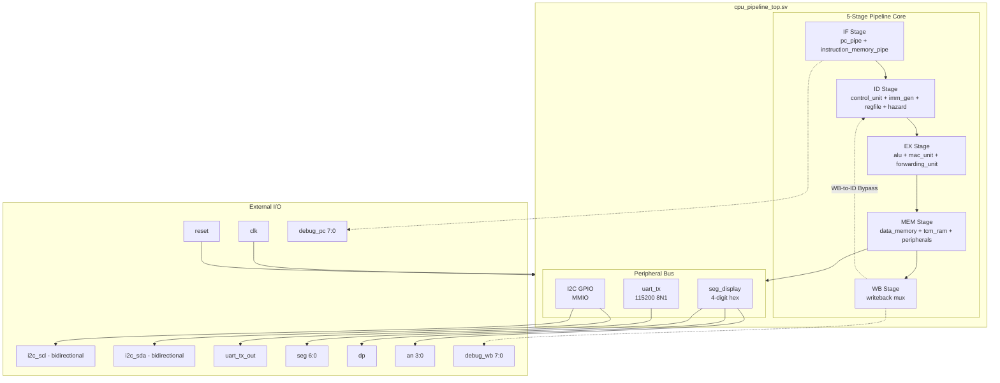
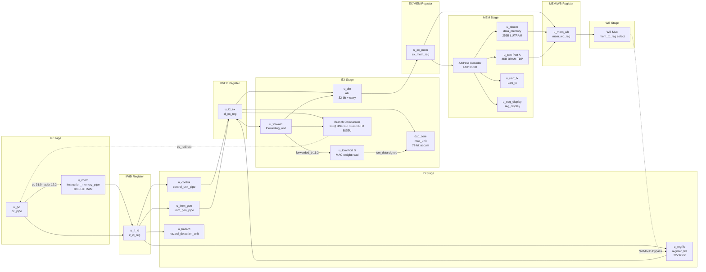
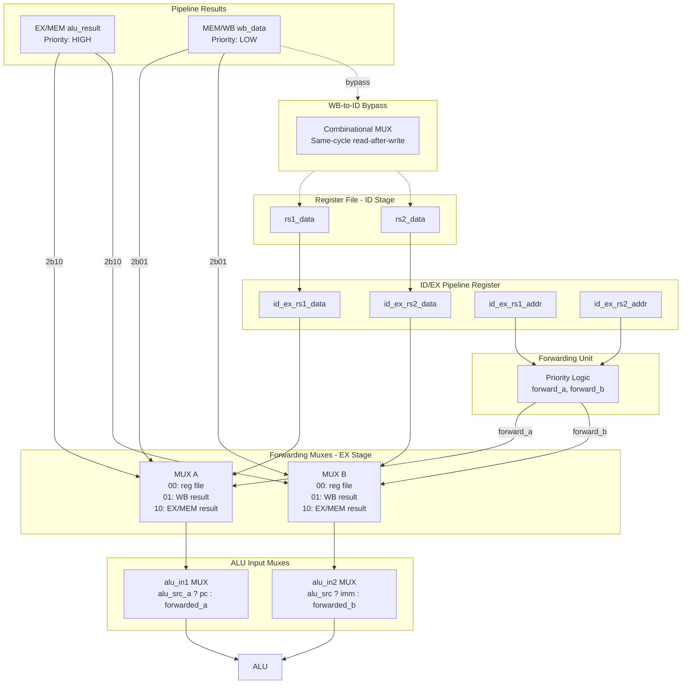
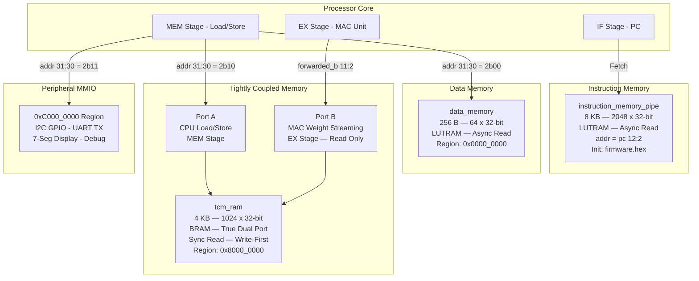
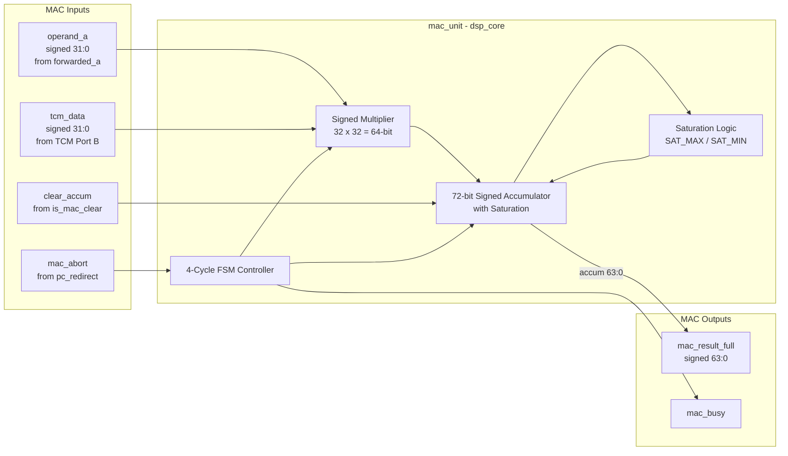
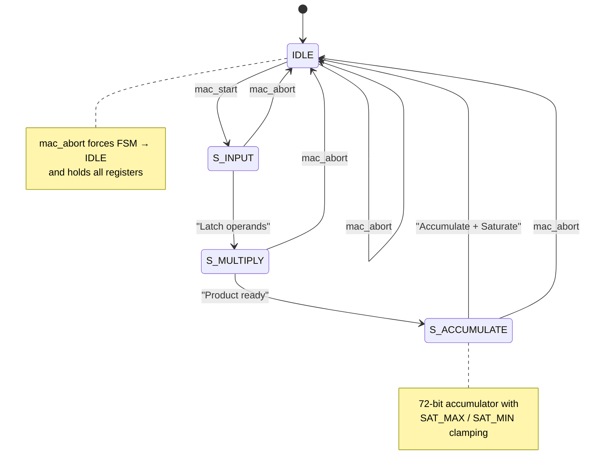
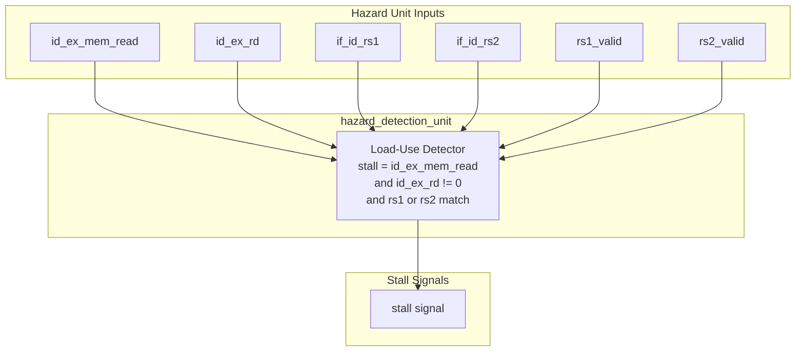
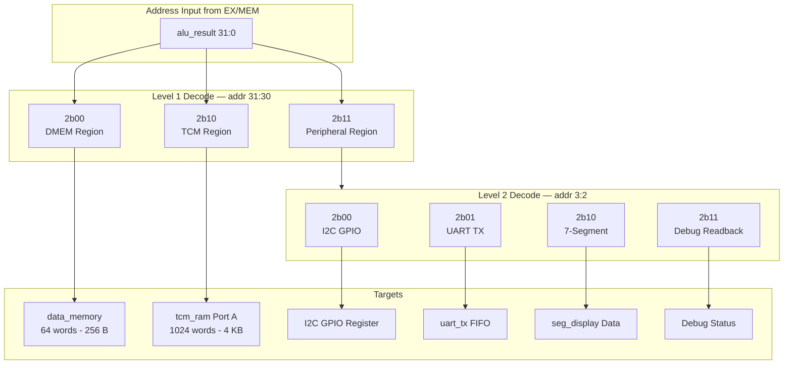
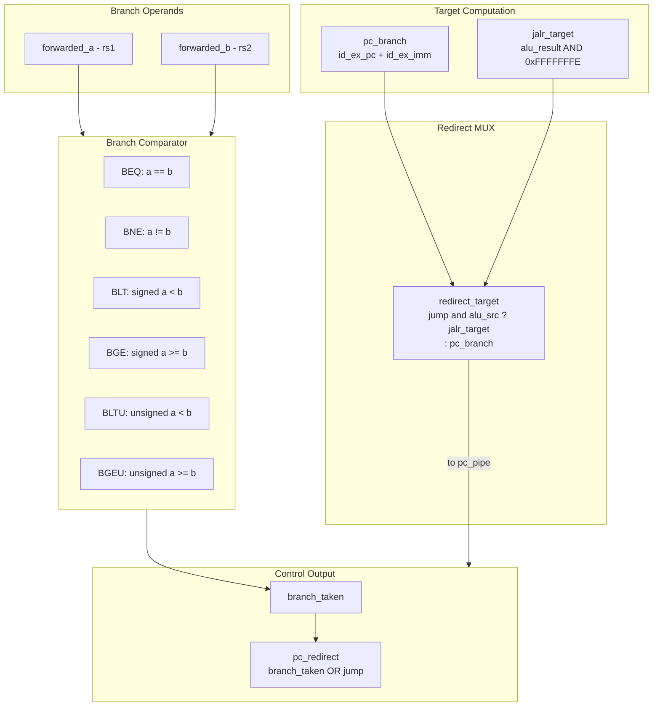

<p align="center">
  <strong>🔬 CoreAccel-V</strong><br/>
  <em>A 5-Stage Pipelined RISC-V RV32I Processor with DSP MAC Extension</em><br/>
  <sub>Architecture Reference Document — Rev 2A · June 2026</sub>
</p>

---

<p align="center">
  <code>RV32I</code> · <code>5-Stage Pipeline</code> · <code>CUSTOM-0 MAC DSP</code> · <code>72-bit Accumulator</code> · <code>Artix-7 FPGA</code>
</p>

---

## Table of Contents

- [1. Overview](#1-overview)
- [2. SoC Block Diagram](#2-soc-block-diagram)
- [3. Top-Level Port Map](#3-top-level-port-map)
- [4. Pipeline Architecture](#4-pipeline-architecture)
- [5. Pipeline Datapath and Forwarding](#5-pipeline-datapath-and-forwarding)
- [6. Memory Hierarchy](#6-memory-hierarchy)
- [7. MAC Unit — DSP Accelerator](#7-mac-unit--dsp-accelerator)
- [8. Pipeline Control and Hazard Logic](#8-pipeline-control-and-hazard-logic)
- [9. Address Decoder and Memory Map](#9-address-decoder-and-memory-map)
- [10. Branch Resolution Logic](#10-branch-resolution-logic)
- [11. ISA and Control Signal Reference](#11-isa-and-control-signal-reference)
- [12. Phase 2A Hardening](#12-phase-2a-hardening)
- [13. Technical Specifications](#13-technical-specifications)
- [14. Module Instantiation Map](#14-module-instantiation-map)

---

## 1. Overview

**CoreAccel-V** is a 5-stage in-order pipelined RISC-V processor implementing the **RV32I** base integer ISA, extended with a **CUSTOM-0** DSP multiply-accumulate (MAC) unit featuring a **72-bit signed accumulator** with saturation arithmetic. The design targets the **Xilinx Artix-7** FPGA (Basys 3) and includes a complete SoC with UART, I2C GPIO, and 7-segment display peripherals.

> [!NOTE]
> This document describes the **Phase 2A hardened** architecture. All signal widths, control paths, and timing have been verified against the RTL source.

### Key Highlights

| Feature | Detail |
|:--------|:-------|
| ISA | RV32I Base Integer + CUSTOM-0 MAC |
| Pipeline | 5-stage in-order: IF → ID → EX → MEM → WB |
| Forwarding | Full 2-stage EX→EX and MEM→EX with priority |
| Hazard Detection | Load-use stall + MAC pipeline stall |
| DSP Extension | 4-cycle signed MAC, 72-bit accumulator, saturation |
| Memory | 8 KB IMEM (LUTRAM) · 256 B DMEM (LUTRAM) · 4 KB TCM (BRAM TDP) |
| Peripherals | UART TX 115200 8N1 · I2C GPIO · 4-digit 7-Segment |
| Target | Xilinx Artix-7 xc7a35tcpg236-1 (Basys 3) |

---

## 2. SoC Block Diagram



---

## 3. Top-Level Port Map

### `cpu_pipeline_top.sv`

| Direction | Port | Width | Description |
|:---------:|:-----|:-----:|:------------|
| `input` | `clk` | 1 | System clock |
| `input` | `reset` | 1 | Active-high synchronous reset |
| `output` | `debug_pc` | `[7:0]` | Lower 8 bits of program counter |
| `output` | `debug_wb` | `[7:0]` | Lower 8 bits of writeback data |
| `inout` | `i2c_scl` | 1 | I2C serial clock — bidirectional |
| `inout` | `i2c_sda` | 1 | I2C serial data — bidirectional |
| `output` | `uart_tx_out` | 1 | UART transmit pin |
| `output` | `seg` | `[6:0]` | 7-segment cathode drivers |
| `output` | `dp` | 1 | 7-segment decimal point |
| `output` | `an` | `[3:0]` | 7-segment anode drivers |

---

## 4. Pipeline Architecture

### 5-Stage Pipeline — Full Module and Signal Map



### Pipeline Register Contents

| Register | Signals |
|:---------|:--------|
| **IF/ID** | `pc[31:0]`, `instruction[31:0]` |
| **ID/EX** | `reg_write`, `mem_to_reg`, `mem_read`, `mem_write`, `alu_src`, `alu_control[3:0]`, `alu_src_a`, `pc_to_reg`, `jump`, `branch`, `is_mac`, `is_mac_clear`, `mac_to_reg`, `is_mac_read_hi`, `pc[31:0]`, `rs1_data[31:0]`, `rs2_data[31:0]`, `imm[31:0]`, `rs1_addr[4:0]`, `rs2_addr[4:0]`, `rd_addr[4:0]`, `funct3[2:0]` |
| **EX/MEM** | `reg_write`, `mem_to_reg`, `mem_read`, `mem_write`, `alu_result[31:0]`, `rs2_data[31:0]`, `rd_addr[4:0]` |
| **MEM/WB** | `reg_write`, `mem_to_reg`, `mem_data[31:0]`, `alu_result[31:0]`, `rd_addr[4:0]` |

---

## 5. Pipeline Datapath and Forwarding

### Forwarding and Bypass Network



### Forwarding Unit Priority Logic

```
forward_a / forward_b encoding:
  2'b10 → EX/MEM result   (highest priority — most recent producer)
  2'b01 → MEM/WB result   (lower priority — older producer)
  2'b00 → Register file   (no hazard)

Condition for EX/MEM forward:
  ex_mem_reg_write && ex_mem_rd != 0 && ex_mem_rd == id_ex_rs{1,2}

Condition for MEM/WB forward (only if EX/MEM does NOT forward):
  mem_wb_reg_write && mem_wb_rd != 0 && mem_wb_rd == id_ex_rs{1,2}
```

### EX Stage Result Mux — Priority Encoding

```
ex_result (output to EX/MEM pipeline register):
  ┌─ Priority 1: JAL / JALR     → id_ex_pc + 4   (return address)
  ├─ Priority 2: MAC_READ       → sliced_mac_result
  └─ Priority 3: Default        → alu_result
```

### MAC Read Slicer

```
sliced_mac_result = is_mac_read_hi ? mac_result_full[63:32]
                                   : mac_result_full[31:0]
```

---

## 6. Memory Hierarchy



### Memory Summary

| Memory | Type | Size | Width | Depth | Read Latency | Interface |
|:-------|:-----|:-----|:-----:|:-----:|:------------:|:----------|
| IMEM | LUTRAM | 8 KB | 32-bit | 2048 | Async (0 cycle) | Single-port, word-addressed `[12:2]` |
| DMEM | LUTRAM | 256 B | 32-bit | 64 | Async (0 cycle) | Single-port, word-addressed |
| TCM | BRAM TDP | 4 KB | 32-bit | 1024 | Sync (1 cycle) | True Dual-Port, write-first mode |

> [!IMPORTANT]
> TCM Port A uses an address from the **EX stage** (1-cycle ahead) for reads to compensate for BRAM synchronous read latency. This ensures the read data is available by the time the MEM stage needs it.

---

## 7. MAC Unit — DSP Accelerator

### MAC Unit Block Diagram



### MAC FSM State Diagram



### MAC Operations via CUSTOM-0 Encoding

| Instruction | Opcode | funct3 / funct7 | Description |
|:------------|:-------|:-----------------|:------------|
| `MAC rd, rs1, rs2` | `0001011` | — | Multiply `rs1 × TCM[rs2]`, accumulate into 72-bit register |
| `MAC_CLEAR` | `0001011` | — | Clear the 72-bit accumulator to zero |
| `MAC_READ_LO rd` | `0001011` | — | Read `accumulator[31:0]` into `rd` |
| `MAC_READ_HI rd` | `0001011` | — | Read `accumulator[63:32]` into `rd` |

### MAC Pipeline Stall Logic

```
mac_start_pulse   = is_mac_ex & ~mac_started_reg & ~mac_busy_ex
mac_stall_request = is_mac_ex & ~(mac_started_reg & ~mac_busy_ex)

When MAC is active:
  - Pipeline stalls (IF, ID, EX held)
  - EX/MEM register is flushed
  - MAC runs for 4 cycles: IDLE → S_INPUT → S_MULTIPLY → S_ACCUMULATE → IDLE
```

### Accumulator Saturation

```
Accumulator width: 72 bits (signed)
Output width:      64 bits (signed) = accumulator[63:0]

If accumulator > SAT_MAX  → clamp to SAT_MAX
If accumulator < SAT_MIN  → clamp to SAT_MIN

This prevents silent wraparound in long MAC chains (e.g., neural network dot products).
```

---

## 8. Pipeline Control and Hazard Logic

### Hazard Detection — Load-Use Stall



### Load-Use Stall Condition

```verilog
stall = id_ex_mem_read
      && (id_ex_rd != 5'b0)
      && (  (rs1_valid && id_ex_rd == if_id_rs1)
         || (rs2_valid && id_ex_rd == if_id_rs2) );
```

### Pipeline Control Signal Matrix

| Signal | Formula | Purpose |
|:-------|:--------|:--------|
| `pc_redirect` | `branch_taken \| id_ex_jump` | Redirect PC on taken branch or jump |
| `pc_write` | `~(stall \| mac_stall) \| pc_redirect` | Enable PC update; redirect overrides stall |
| `if_id_stall` | `(stall \| mac_stall) & ~pc_redirect` | Freeze IF/ID register |
| `if_id_flush` | `pc_redirect` | Flush IF/ID on redirect |
| `id_ex_flush` | `stall \| pc_redirect` | Insert bubble on stall or redirect |
| `id_ex_stall` | `mac_stall_request` | Freeze ID/EX during MAC |
| `ex_mem_flush` | `mac_stall_request` | Flush EX/MEM during MAC stall |

### Stall and Flush Priority

```
                    ┌──────────────────────────────────────┐
                    │         pc_redirect (highest)        │
                    │   Overrides all stalls, flushes      │
                    │   IF/ID and ID/EX pipeline regs      │
                    ├──────────────────────────────────────┤
                    │         mac_stall_request            │
                    │   Stalls IF, ID, EX stages           │
                    │   Flushes EX/MEM register            │
                    ├──────────────────────────────────────┤
                    │         load-use stall               │
                    │   Stalls IF, ID stages               │
                    │   Inserts bubble in ID/EX            │
                    └──────────────────────────────────────┘
```

---

## 9. Address Decoder and Memory Map

### Address Decoder Diagram



### Memory Map Table

| Base Address | End Address | Size | Region | Access | Description |
|:-------------|:-----------|:-----|:-------|:------:|:------------|
| `0x0000_0000` | `0x3FFF_FFFF` | 256 B | DMEM | R/W | Data memory — LUTRAM async |
| `0x8000_0000` | `0xBFFF_FFFF` | 4 KB | TCM | R/W | Tightly coupled — BRAM TDP |
| `0xC000_0000` | — | 4 B | I2C GPIO | R/W | I2C SCL/SDA bidirectional |
| `0xC000_0004` | — | 4 B | UART TX | W | UART transmit, 115200 8N1 |
| `0xC000_0008` | — | 4 B | 7-Segment | W | 4-digit hex, 1 kHz refresh |
| `0xC000_000C` | — | 4 B | Debug | R | Debug readback register |

### MEM Read Mux Priority

```
mem_read_data =
    gpio_access  → gpio_rdata
    tcm_access   → tcm_douta
    default      → dmem_read_data
```

---

## 10. Branch Resolution Logic

### Branch Resolution in EX Stage



### Branch / Jump Target Summary

| Type | Target Computation | Condition |
|:-----|:-------------------|:----------|
| **BEQ/BNE/BLT/BGE/BLTU/BGEU** | `id_ex_pc + id_ex_imm` | Comparator result on `forwarded_a`, `forwarded_b` |
| **JAL** | `id_ex_pc + id_ex_imm` | Always taken; writes `PC+4` to `rd` |
| **JALR** | `alu_result & 0xFFFFFFFE` | Always taken; writes `PC+4` to `rd` |

### Redirect Target MUX

```
redirect_target = (id_ex_jump && alu_src) ? jalr_target : pc_branch

Where:
  pc_branch   = id_ex_pc + id_ex_imm
  jalr_target = (forwarded_a + id_ex_imm) & 32'hFFFFFFFE
```

---

## 11. ISA and Control Signal Reference

### Supported Instructions — RV32I + CUSTOM-0

| Type | Opcode | Instructions | Count |
|:-----|:-------|:-------------|:-----:|
| **R-type** | `0110011` | ADD, SUB, SLL, SLT, SLTU, XOR, SRL, SRA, OR, AND | 10 |
| **I-type ALU** | `0010011` | ADDI, SLTI, SLTIU, XORI, ORI, ANDI, SLLI, SRLI, SRAI | 9 |
| **Load** | `0000011` | LW | 1 |
| **Store** | `0100011` | SW | 1 |
| **Branch** | `1100011` | BEQ, BNE, BLT, BGE, BLTU, BGEU | 6 |
| **LUI** | `0110111` | LUI | 1 |
| **AUIPC** | `0010111` | AUIPC | 1 |
| **JAL** | `1101111` | JAL | 1 |
| **JALR** | `1100111` | JALR | 1 |
| **CUSTOM-0** | `0001011` | MAC, MAC_CLEAR, MAC_READ_LO, MAC_READ_HI | 4 |
| | | **Total** | **35** |

### ALU Operations

| `alu_control[3:0]` | Operation | RTL Expression |
|:-------------------:|:----------|:---------------|
| `0000` | ADD | `{1'b0,a} + {1'b0,b}` — 33-bit carry chain |
| `0001` | SUB | `{1'b0,a} - {1'b0,b}` — 33-bit carry chain |
| `0010` | SLL | `a << b[4:0]` |
| `0011` | SLT | `($signed(a) < $signed(b)) ? 1 : 0` |
| `0100` | SLTU | `(a < b) ? 1 : 0` |
| `0101` | XOR | `a ^ b` |
| `0110` | SRL | `a >> b[4:0]` |
| `0111` | SRA | `$signed(a) >>> b[4:0]` |
| `1000` | OR | `a \| b` |
| `1001` | AND | `a & b` |
| `1010` | PASS_B | `b` — used for LUI pass-through |

### ALU Flags

| Flag | Computation |
|:-----|:------------|
| `zero` | `result == 0` |
| `sign` | `result[31]` |
| `overflow` | Signed overflow detection |
| `carry` | `add_result[32]` or `sub_result[32]` |

### Control Signals by Instruction Type

| Signal | R-type | I-ALU | LW | SW | Branch | LUI | AUIPC | JAL | JALR | MAC |
|:-------|:------:|:-----:|:--:|:--:|:------:|:---:|:-----:|:---:|:----:|:---:|
| `reg_write` | ✅ | ✅ | ✅ | ❌ | ❌ | ✅ | ✅ | ✅ | ✅ | ✅ |
| `mem_to_reg` | ❌ | ❌ | ✅ | ❌ | ❌ | ❌ | ❌ | ❌ | ❌ | ❌ |
| `mem_read` | ❌ | ❌ | ✅ | ❌ | ❌ | ❌ | ❌ | ❌ | ❌ | ❌ |
| `mem_write` | ❌ | ❌ | ❌ | ✅ | ❌ | ❌ | ❌ | ❌ | ❌ | ❌ |
| `alu_src` | ❌ | ✅ | ✅ | ✅ | ❌ | ✅ | ✅ | ❌ | ✅ | ❌ |
| `alu_src_a` | ❌ | ❌ | ❌ | ❌ | ❌ | ❌ | ✅ | ❌ | ❌ | ❌ |
| `branch` | ❌ | ❌ | ❌ | ❌ | ✅ | ❌ | ❌ | ❌ | ❌ | ❌ |
| `jump` | ❌ | ❌ | ❌ | ❌ | ❌ | ❌ | ❌ | ✅ | ✅ | ❌ |
| `is_mac` | ❌ | ❌ | ❌ | ❌ | ❌ | ❌ | ❌ | ❌ | ❌ | ✅ |

### Immediate Generation

| Instruction Type | Bit Assembly | Sign Extension |
|:-----------------|:-------------|:---------------|
| **I-type** | `{instr[31:20]}` | `instr[31]` replicated to 32 bits |
| **S-type** | `{instr[31:25], instr[11:7]}` | `instr[31]` replicated |
| **B-type** | `{instr[31], instr[7], instr[30:25], instr[11:8], 1'b0}` | `instr[31]` replicated |
| **U-type** | `{instr[31:12], 12'b0}` | Upper 20 bits, lower 12 zero |
| **J-type** | `{instr[31], instr[19:12], instr[20], instr[30:21], 1'b0}` | `instr[31]` replicated |

---

## 12. Phase 2A Hardening

The Phase 2A revision applies critical robustness improvements to the MAC datapath and pipeline control. These changes prevent silent data corruption in signed arithmetic chains.

| Area | Issue | Fix Applied |
|:-----|:------|:------------|
| **MAC Port Signedness** | Operand ports were implicitly unsigned | Explicit `signed [31:0]` declarations on `operand_a` and `tcm_data` |
| **Sign Extension** | Missing sign extension on MAC operands entering the multiplier | Explicit sign-extension logic ensures correct 64-bit products for negative values |
| **Saturation Parameters** | Hardcoded magic numbers for saturation bounds | Named parameters `SAT_MAX` and `SAT_MIN` for the 72-bit accumulator |
| **MAC Abort Mechanism** | No mechanism to cancel in-flight MAC on branch/jump | `mac_abort` signal wired to `pc_redirect`; forces FSM → IDLE and holds registers |
| **Accumulator Width** | 64-bit accumulator could overflow during long chains | Extended to 72-bit signed accumulator with headroom for extended MAC sequences |

> [!TIP]
> The `mac_abort` mechanism is critical for correctness: without it, a branch misprediction during a 4-cycle MAC would leave stale data in the accumulator. The abort signal forces an immediate return to IDLE and preserves register state.

---

## 13. Technical Specifications

| Specification | Value |
|:--------------|:------|
| **ISA** | RISC-V RV32I + CUSTOM-0 |
| **Pipeline Depth** | 5 stages (IF → ID → EX → MEM → WB) |
| **Pipeline Type** | In-order, single-issue |
| **Data Width** | 32-bit |
| **Register File** | 32 × 32-bit, x0 hardwired to zero |
| **Register Read** | Async read, 2 read ports |
| **Register Write** | Sync write, 1 write port |
| **ALU** | 32-bit + 33-bit carry chain |
| **MAC Accumulator** | 72-bit signed with saturation |
| **MAC Latency** | 4 cycles (IDLE→INPUT→MULTIPLY→ACCUMULATE) |
| **Instruction Memory** | 8 KB, 2048×32, LUTRAM, async |
| **Data Memory** | 256 B, 64×32, LUTRAM, async |
| **TCM** | 4 KB, 1024×32, BRAM TDP, sync, write-first |
| **Forwarding** | 2-stage: EX→EX, MEM→EX with priority |
| **WB Bypass** | Combinational same-cycle read-after-write |
| **Hazard Detection** | Load-use stall + MAC stall |
| **Branch Resolution** | EX stage, 1-cycle penalty |
| **UART** | TX only, 115200 baud, 8N1 |
| **Display** | 4-digit 7-segment, 1 kHz multiplex refresh |
| **Target FPGA** | Xilinx Artix-7 xc7a35tcpg236-1 |
| **Target Board** | Digilent Basys 3 |
| **HDL** | SystemVerilog |
| **Module Count** | 17 instances in top-level |

---

## 14. Module Instantiation Map

| # | Instance Name | Module | Pipeline Stage | Description |
|:-:|:--------------|:-------|:---------------|:------------|
| 1 | `u_pc` | `pc_pipe` | IF | Program counter with stall, redirect |
| 2 | `u_imem` | `instruction_memory_pipe` | IF | 8 KB instruction memory, LUTRAM |
| 3 | `u_if_id` | `if_id_reg` | IF→ID | Pipeline register |
| 4 | `u_control` | `control_unit_pipe` | ID | Full RV32I + CUSTOM-0 decoder |
| 5 | `u_imm_gen` | `imm_gen_pipe` | ID | Immediate generator (I/S/B/U/J) |
| 6 | `u_regfile` | `register_file` | ID/WB | 32×32 register file, async read |
| 7 | `u_hazard` | `hazard_detection_unit` | ID | Load-use stall detection |
| 8 | `u_id_ex` | `id_ex_reg` | ID→EX | Pipeline register (widest) |
| 9 | `u_forward` | `forwarding_unit` | EX | 2-stage forwarding with priority |
| 10 | `u_alu` | `alu` | EX | 32-bit ALU, 33-bit carry chain |
| 11 | `dsp_core` | `mac_unit` | EX | 4-cycle MAC, 72-bit accumulator |
| 12 | `u_ex_mem` | `ex_mem_reg` | EX→MEM | Pipeline register |
| 13 | `u_dmem` | `data_memory` | MEM | 256 B data memory, LUTRAM |
| 14 | `u_tcm` | `tcm_ram` | MEM+EX | 4 KB TCM, BRAM TDP |
| 15 | `u_uart_tx` | `uart_tx` | MEM | UART transmitter, 115200 8N1 |
| 16 | `u_seg_display` | `seg_display` | MEM | 4-digit 7-segment controller |
| 17 | `u_mem_wb` | `mem_wb_reg` | MEM→WB | Pipeline register |

---

<p align="center">
  <sub>CoreAccel-V Architecture Document · Rev 2A · Generated June 2026</sub><br/>
  <sub>Verified against RTL source · All signal widths and control paths confirmed</sub>
</p>
