# CoreAccel-V — Cache-Coherent Dual-Core SIMD DSP SoC

### *A Silicon-Proven Symmetric Multiprocessor for Real-Time Signal Processing*

> **Architecture Specification v1.0** · Target: Xilinx Artix-7 / SkyWater Sky130  
> Classification: Complete Dual-Hart SoC with MESI Coherency, SIMD ALU, FFT Accelerator, and DMA

---

## Table of Contents

1. [Executive Summary](#1-executive-summary)
2. [SoC Block Diagram](#2-soc-block-diagram)
3. [Core Pipeline Architecture](#3-core-pipeline-architecture)
4. [SIMD ALU Architecture](#4-simd-alu-architecture)
5. [L1 Data Cache Architecture](#5-l1-data-cache-architecture)
6. [MESI Coherency Protocol](#6-mesi-coherency-protocol)
7. [Snoop Bus Protocol](#7-snoop-bus-protocol)
8. [Dirty Intervention Protocol](#8-dirty-intervention-protocol)
9. [AXI4-Lite Bus Fabric](#9-axi4-lite-bus-fabric)
10. [Memory Hierarchy](#10-memory-hierarchy)
11. [Address Map](#11-address-map)
12. [DMA Controller](#12-dma-controller)
13. [FFT Accelerator](#13-fft-accelerator)
14. [Interrupt System](#14-interrupt-system)
15. [Atomic Operations & Multi-Hart Boot](#15-atomic-operations--multi-hart-boot)
16. [Physical Implementation](#16-physical-implementation)
17. [Technology Specifications](#17-technology-specifications)
18. [Module Inventory](#18-module-inventory)

---

## 1. Executive Summary

CoreAccel-V is a **symmetric dual-core SoC** built around a custom RISC-V ISA (RV32IM + A-Extension + P-Extension subset). The architecture targets **real-time DSP workloads** such as audio filtering, FFT computation, and sensor fusion — deployable on both FPGA fabric and ASIC silicon.

**Key differentiators:**

| Feature | Specification |
|---|---|
| **Cores** | 2× CoreAccel-V harts, 6-stage in-order pipeline |
| **SIMD** | P-Extension segmented ALU (32/16/8-bit modes) |
| **Coherency** | Full MESI snoopy protocol with dirty intervention |
| **Accelerators** | Radix-2 DIT FFT engine + multi-channel DMA |
| **Atomics** | LR/SC + AMO for lock-free concurrency |
| **Targets** | Artix-7 xc7a35t (FPGA) · Sky130 PDK (ASIC) |

> [!IMPORTANT]
> This document describes the **target state** of the SoC after all development phases are complete. Individual modules may be at varying stages of implementation.

---

## 2. SoC Block Diagram

The complete dual-core SoC with all interconnects, accelerators, and peripheral subsystems:

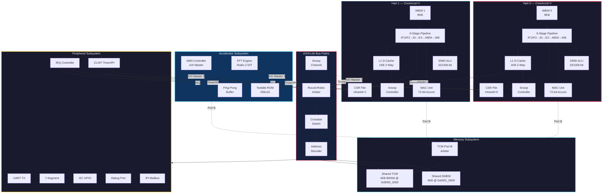
```mermaid
graph TB
    subgraph CORE0["Hart 0 — CoreAccel-V"]
        IMEM0["IMEM 0<br/>8KB"]
        PIPE0["6-Stage Pipeline<br/>IF1/IF2→ID→EX→MEM→WB"]
        SIMD0["SIMD ALU<br/>32/16/8-bit"]
        MAC0["MAC Unit<br/>72-bit Accum"]
        CSR0["CSR File<br/>mhartid=0"]
        L1D0["L1 D-Cache<br/>1KB 2-Way"]
        SNOOP0["Snoop<br/>Controller"]
    end

    subgraph CORE1["Hart 1 — CoreAccel-V"]
        IMEM1["IMEM 1<br/>8KB"]
        PIPE1["6-Stage Pipeline<br/>IF1/IF2→ID→EX→MEM→WB"]
        SIMD1["SIMD ALU<br/>32/16/8-bit"]
        MAC1["MAC Unit<br/>72-bit Accum"]
        CSR1["CSR File<br/>mhartid=1"]
        L1D1["L1 D-Cache<br/>1KB 2-Way"]
        SNOOP1["Snoop<br/>Controller"]
    end

    subgraph BUSFAB["AXI4-Lite Bus Fabric"]
        ARB["Round-Robin<br/>Arbiter"]
        XBAR["Crossbar<br/>Switch"]
        ADEC["Address<br/>Decoder"]
        SBUS["Snoop<br/>Channel"]
    end

    subgraph ACCEL["Accelerator Subsystem"]
        DMA["DMA Controller<br/>AXI Master"]
        FFT["FFT Engine<br/>Radix-2 DIT"]
        TWID["Twiddle ROM<br/>256x16"]
        FFTBUF["Ping-Pong<br/>Buffer"]
    end

    subgraph MEM["Memory Subsystem"]
        DMEM["Shared DMEM<br/>4KB @ 0x0001_0000"]
        TCM["Shared TCM<br/>4KB BRAM @ 0x8000_0000"]
        TCMARB["TCM Port-B<br/>Arbiter"]
    end

    subgraph PERIPH["Peripheral Subsystem"]
        UART["UART TX"]
        SEG["7-Segment"]
        I2CGPIO["I2C GPIO"]
        DBG["Debug Port"]
        IRQC["IRQ Controller"]
        CLINT["CLINT Timer/IPI"]
        IPI["IPI Mailbox"]
    end

    PIPE0 --- SIMD0
    PIPE0 --- MAC0
    PIPE0 --- CSR0
    IMEM0 --> PIPE0
    PIPE0 --> L1D0
    L1D0 --> SNOOP0

    PIPE1 --- SIMD1
    PIPE1 --- MAC1
    PIPE1 --- CSR1
    IMEM1 --> PIPE1
    PIPE1 --> L1D1
    L1D1 --> SNOOP1

    L1D0 -->|"AXI Master 0"| ARB
    L1D1 -->|"AXI Master 1"| ARB
    DMA -->|"AXI Master 2"| ARB
    FFT -->|"AXI Master 3"| ARB

    ARB --> XBAR
    XBAR --> ADEC

    SBUS -.->|"Snoop"| SNOOP0
    SBUS -.->|"Snoop"| SNOOP1

    ADEC --> DMEM
    ADEC --> TCM
    ADEC --> PERIPH

    FFT --- TWID
    FFT --- FFTBUF
    MAC0 -.->|"Port B"| TCMARB
    MAC1 -.->|"Port B"| TCMARB
    FFT -.->|"Port B"| TCMARB
    TCMARB --> TCM

    IRQC -->|"IRQ"| CSR0
    IRQC -->|"IRQ"| CSR1
    CLINT -->|"Timer/IPI"| CSR0
    CLINT -->|"Timer/IPI"| CSR1

    style CORE0 fill:#1a1a2e,stroke:#e94560,stroke-width:3px,color:#eee
    style CORE1 fill:#1a1a2e,stroke:#0f3460,stroke-width:3px,color:#eee
    style BUSFAB fill:#16213e,stroke:#e94560,stroke-width:2px,color:#eee
    style ACCEL fill:#0f3460,stroke:#53d8fb,stroke-width:2px,color:#eee
    style MEM fill:#1a1a2e,stroke:#53d8fb,stroke-width:2px,color:#eee
    style PERIPH fill:#1a1a2e,stroke:#ffc300,stroke-width:2px,color:#eee
```

---

## 3. Core Pipeline Architecture

Each CoreAccel-V hart implements a **6-stage in-order pipeline** with a 2-cycle instruction fetch to accommodate synchronous BRAM read latency.

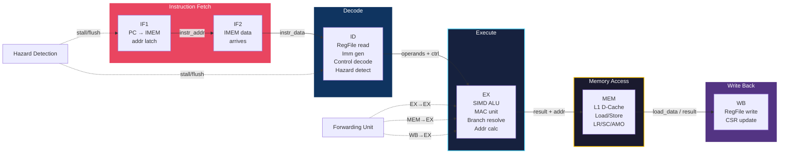
```mermaid
graph LR
    subgraph FETCH["Instruction Fetch"]
        IF1["IF1<br/>PC → IMEM<br/>addr latch"]
        IF2["IF2<br/>IMEM data<br/>arrives"]
    end

    subgraph DECODE["Decode"]
        ID["ID<br/>RegFile read<br/>Imm gen<br/>Control decode<br/>Hazard detect"]
    end

    subgraph EXECUTE["Execute"]
        EX["EX<br/>SIMD ALU<br/>MAC unit<br/>Branch resolve<br/>Addr calc"]
    end

    subgraph MEMORY["Memory Access"]
        ME["MEM<br/>L1 D-Cache<br/>Load/Store<br/>LR/SC/AMO"]
    end

    subgraph WRITEBACK["Write Back"]
        WB["WB<br/>RegFile write<br/>CSR update"]
    end

    IF1 -->|"instr_addr"| IF2
    IF2 -->|"instr_data"| ID
    ID -->|"operands + ctrl"| EX
    EX -->|"result + addr"| ME
    ME -->|"load_data / result"| WB

    FWD["Forwarding Unit"] -.->|"EX→EX"| EX
    FWD -.->|"MEM→EX"| EX
    FWD -.->|"WB→EX"| EX
    HAZ["Hazard Detection"] -.->|"stall/flush"| IF1
    HAZ -.->|"stall/flush"| ID

    style FETCH fill:#e94560,stroke:#fff,stroke-width:2px,color:#fff
    style DECODE fill:#0f3460,stroke:#fff,stroke-width:2px,color:#fff
    style EXECUTE fill:#16213e,stroke:#53d8fb,stroke-width:2px,color:#fff
    style MEMORY fill:#1a1a2e,stroke:#ffc300,stroke-width:2px,color:#fff
    style WRITEBACK fill:#533483,stroke:#fff,stroke-width:2px,color:#fff
```

### Pipeline Hazard Resolution

| Hazard | Detection | Resolution |
|---|---|---|
| **RAW (Read-After-Write)** | Src reg matches EX/MEM/WB dest | Forwarding from EX→EX, MEM→EX, WB→EX |
| **Load-Use** | Load in EX, dependent instr in ID | 1-cycle pipeline stall + bubble |
| **Control (Branch)** | Branch resolved in EX stage | Flush IF1, IF2, ID; redirect PC |
| **Cache Miss** | L1 D-Cache miss in MEM stage | Full pipeline stall until fill completes |
| **MAC Stall** | Multi-cycle MAC in EX | Stall pipeline for MAC latency |

### Pipeline Register Interfaces

| Register | Width (bits) | Key Fields |
|---|---|---|
| **IF1/IF2** | ~64 | `pc`, `valid` |
| **IF/ID** | ~96 | `pc`, `instruction`, `valid` |
| **ID/EX** | ~256 | `pc`, `rs1_data`, `rs2_data`, `imm`, `ctrl_signals`, `rd`, `rs1`, `rs2`, `simd_mode` |
| **EX/MEM** | ~200 | `alu_result`, `rs2_data`, `ctrl_signals`, `rd`, `mac_result`, `is_atomic` |
| **MEM/WB** | ~128 | `alu_result`, `mem_data`, `ctrl_signals`, `rd`, `csr_data` |

---

## 4. SIMD ALU Architecture

The segmented ALU achieves sub-word parallelism by inserting **carry-kill multiplexers** at byte boundaries (bits 8, 16, 24), enabling simultaneous operation on packed data elements.

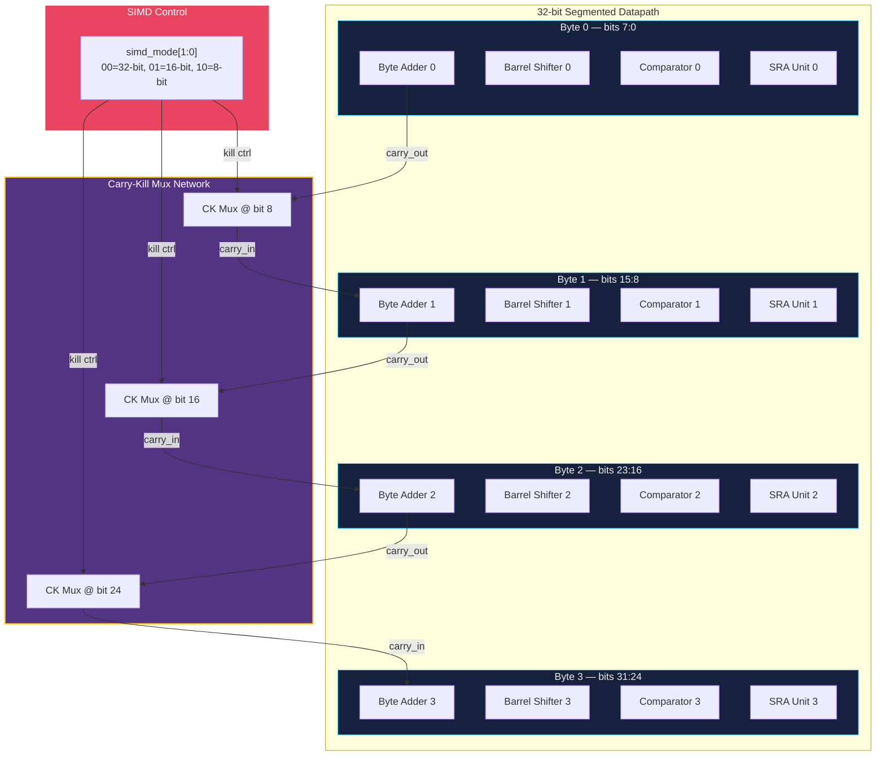
```mermaid
graph TB
    subgraph CONTROL["SIMD Control"]
        MODE["simd_mode[1:0]<br/>00=32-bit, 01=16-bit, 10=8-bit"]
    end

    subgraph DATAPATH["32-bit Segmented Datapath"]
        subgraph BYTE3["Byte 3 — bits 31:24"]
            ADD3["Byte Adder 3"]
            SH3["Barrel Shifter 3"]
            CMP3["Comparator 3"]
            SRA3["SRA Unit 3"]
        end
        subgraph BYTE2["Byte 2 — bits 23:16"]
            ADD2["Byte Adder 2"]
            SH2["Barrel Shifter 2"]
            CMP2["Comparator 2"]
            SRA2["SRA Unit 2"]
        end
        subgraph BYTE1["Byte 1 — bits 15:8"]
            ADD1["Byte Adder 1"]
            SH1["Barrel Shifter 1"]
            CMP1["Comparator 1"]
            SRA1["SRA Unit 1"]
        end
        subgraph BYTE0["Byte 0 — bits 7:0"]
            ADD0["Byte Adder 0"]
            SH0["Barrel Shifter 0"]
            CMP0["Comparator 0"]
            SRA0["SRA Unit 0"]
        end
    end

    subgraph CARRY["Carry-Kill Mux Network"]
        CK24["CK Mux @ bit 24"]
        CK16["CK Mux @ bit 16"]
        CK8["CK Mux @ bit 8"]
    end

    ADD0 -->|"carry_out"| CK8
    CK8 -->|"carry_in"| ADD1
    ADD1 -->|"carry_out"| CK16
    CK16 -->|"carry_in"| ADD2
    ADD2 -->|"carry_out"| CK24
    CK24 -->|"carry_in"| ADD3

    MODE -->|"kill ctrl"| CK8
    MODE -->|"kill ctrl"| CK16
    MODE -->|"kill ctrl"| CK24

    style CONTROL fill:#e94560,stroke:#fff,stroke-width:2px,color:#fff
    style BYTE3 fill:#16213e,stroke:#53d8fb,stroke-width:1px,color:#eee
    style BYTE2 fill:#16213e,stroke:#53d8fb,stroke-width:1px,color:#eee
    style BYTE1 fill:#16213e,stroke:#53d8fb,stroke-width:1px,color:#eee
    style BYTE0 fill:#16213e,stroke:#53d8fb,stroke-width:1px,color:#eee
    style CARRY fill:#533483,stroke:#ffc300,stroke-width:2px,color:#fff
```

### Carry-Kill Logic

| `simd_mode` | CK @ bit 8 | CK @ bit 16 | CK @ bit 24 | Active Lanes |
|---|---|---|---|---|
| `2'b00` (Scalar 32-bit) | **Pass** | **Pass** | **Pass** | 1 × 32-bit |
| `2'b01` (Dual 16-bit) | **Pass** | **Kill** | **Pass** | 2 × 16-bit |
| `2'b10` (Quad 8-bit) | **Kill** | **Kill** | **Kill** | 4 × 8-bit |

### P-Extension Instruction Set

| Instruction | Operation | SIMD Mode | Description |
|---|---|---|---|
| `ADD16` | `{rs1[31:16]+rs2[31:16], rs1[15:0]+rs2[15:0]}` | Dual 16-bit | Packed 16-bit add |
| `SUB16` | `{rs1[31:16]-rs2[31:16], rs1[15:0]-rs2[15:0]}` | Dual 16-bit | Packed 16-bit subtract |
| `ADD8` | Per-byte addition | Quad 8-bit | Packed 8-bit add |
| `SUB8` | Per-byte subtraction | Quad 8-bit | Packed 8-bit subtract |
| `SLL16` | Per-halfword left shift | Dual 16-bit | Packed 16-bit shift left |
| `SRA16` | Per-halfword arithmetic right shift | Dual 16-bit | Packed 16-bit shift right |
| `SLL8` | Per-byte left shift | Quad 8-bit | Packed 8-bit shift left |
| `CMPEQ16` | Per-halfword equality compare | Dual 16-bit | Packed 16-bit compare |

---

## 5. L1 Data Cache Architecture

Each core has a private **1KB, 2-way set-associative, write-back L1 data cache** with MESI coherency state per line.

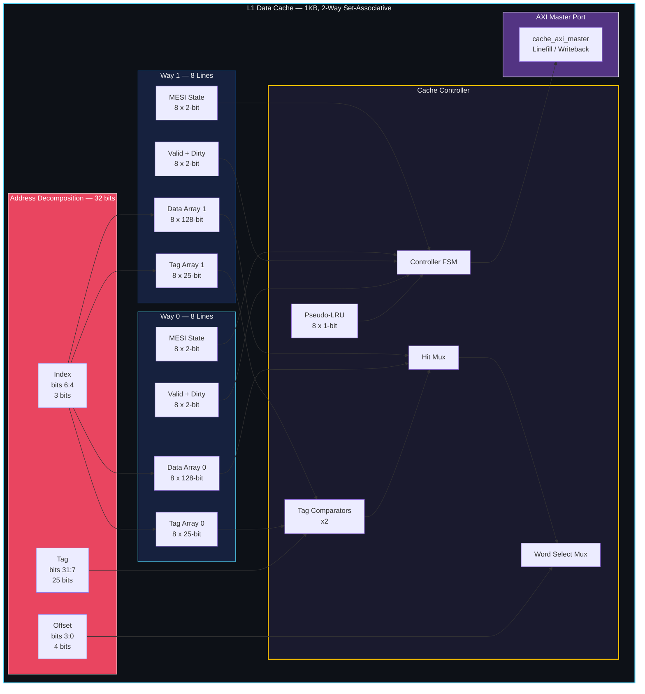
```mermaid
graph TB
    subgraph CACHE["L1 Data Cache — 1KB, 2-Way Set-Associative"]
        subgraph ADDR["Address Decomposition — 32 bits"]
            TAG_F["Tag<br/>bits 31:7<br/>25 bits"]
            IDX_F["Index<br/>bits 6:4<br/>3 bits"]
            OFF_F["Offset<br/>bits 3:0<br/>4 bits"]
        end

        subgraph WAY0["Way 0 — 8 Lines"]
            TA0["Tag Array 0<br/>8 x 25-bit"]
            DA0["Data Array 0<br/>8 x 128-bit"]
            VA0["Valid + Dirty<br/>8 x 2-bit"]
            MS0["MESI State<br/>8 x 2-bit"]
        end

        subgraph WAY1["Way 1 — 8 Lines"]
            TA1["Tag Array 1<br/>8 x 25-bit"]
            DA1["Data Array 1<br/>8 x 128-bit"]
            VA1["Valid + Dirty<br/>8 x 2-bit"]
            MS1["MESI State<br/>8 x 2-bit"]
        end

        subgraph CTRL["Cache Controller"]
            FSM["Controller FSM"]
            LRU["Pseudo-LRU<br/>8 x 1-bit"]
            TCMP["Tag Comparators<br/>x2"]
            HMUX["Hit Mux"]
            WMUX["Word Select Mux"]
        end

        subgraph AXIPORT["AXI Master Port"]
            AXIM["cache_axi_master<br/>Linefill / Writeback"]
        end
    end

    TAG_F --> TCMP
    IDX_F --> TA0
    IDX_F --> TA1
    IDX_F --> DA0
    IDX_F --> DA1
    OFF_F --> WMUX

    TA0 --> TCMP
    TA1 --> TCMP
    TCMP --> HMUX
    HMUX --> WMUX

    DA0 --> HMUX
    DA1 --> HMUX

    FSM --> AXIM
    LRU --> FSM
    VA0 --> FSM
    VA1 --> FSM
    MS0 --> FSM
    MS1 --> FSM

    style CACHE fill:#0d1117,stroke:#53d8fb,stroke-width:2px,color:#eee
    style ADDR fill:#e94560,stroke:#fff,stroke-width:1px,color:#fff
    style WAY0 fill:#16213e,stroke:#53d8fb,stroke-width:1px,color:#eee
    style WAY1 fill:#16213e,stroke:#0f3460,stroke-width:1px,color:#eee
    style CTRL fill:#1a1a2e,stroke:#ffc300,stroke-width:2px,color:#eee
    style AXIPORT fill:#533483,stroke:#fff,stroke-width:1px,color:#fff
```

### Cache Line Format (157 bits)

```
┌───────┬───────┬────────────┬──────────┬───────────────────────────────────────────┐
│ Valid │ Dirty │ MESI State │   Tag    │                  Data                     │
│ 1 bit │ 1 bit │   2 bits   │ 25 bits  │               128 bits                    │
│       │       │ M/E/S/I    │ [31:7]   │  Word3  │  Word2  │  Word1  │  Word0      │
└───────┴───────┴────────────┴──────────┴───────────────────────────────────────────┘
```

### Cache Geometry

| Parameter | Value |
|---|---|
| Total size | 1,024 bytes (1 KB) |
| Associativity | 2-way set-associative |
| Line size | 16 bytes (4 words) |
| Number of sets | 8 |
| Lines per way | 8 |
| Total lines | 16 |
| Tag bits | 25 |
| Index bits | 3 |
| Offset bits | 4 |
| Replacement | Pseudo-LRU (1 bit/set) |
| Write policy | Write-back, write-allocate |

### Cache Controller FSM

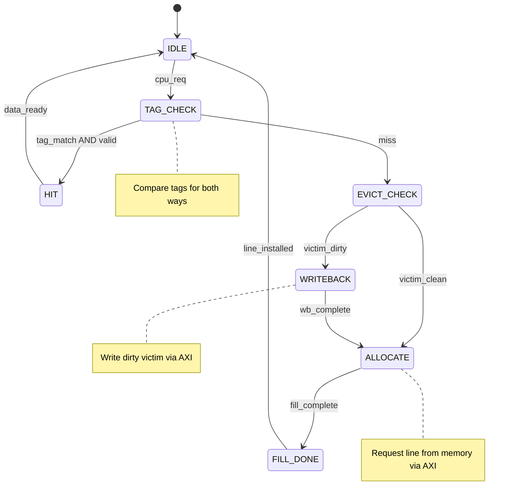
```mermaid
stateDiagram-v2
    [*] --> IDLE

    IDLE --> TAG_CHECK : cpu_req
    TAG_CHECK --> HIT : tag_match AND valid
    TAG_CHECK --> EVICT_CHECK : miss

    HIT --> IDLE : data_ready

    EVICT_CHECK --> WRITEBACK : victim_dirty
    EVICT_CHECK --> ALLOCATE : victim_clean

    WRITEBACK --> ALLOCATE : wb_complete
    ALLOCATE --> FILL_DONE : fill_complete
    FILL_DONE --> IDLE : line_installed

    note right of TAG_CHECK : Compare tags for both ways
    note right of WRITEBACK : Write dirty victim via AXI
    note right of ALLOCATE : Request line from memory via AXI
```

---

## 6. MESI Coherency Protocol

The SoC implements a **full MESI snoopy bus protocol** ensuring cache coherence between the two cores. Each cache line carries a 2-bit MESI state, and every bus transaction is snooped by all caches.

### MESI State Encoding

| State | Code | Meaning | Valid? | Dirty? | Shared? |
|---|---|---|---|---|---|
| **Modified** | `2'b11` | Exclusive, dirty — only copy | Yes | Yes | No |
| **Exclusive** | `2'b10` | Exclusive, clean — only copy | Yes | No | No |
| **Shared** | `2'b01` | Valid, clean — may exist elsewhere | Yes | No | Yes |
| **Invalid** | `2'b00` | Not present | No | — | — |

### MESI State Transition Diagram — All 12 Transitions

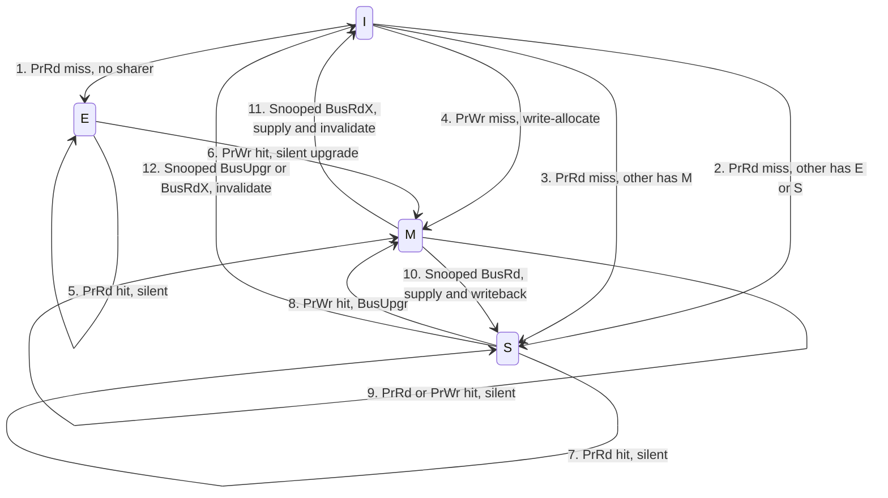
```mermaid
stateDiagram-v2
    I --> E : 1. PrRd miss, no sharer
    I --> S : 2. PrRd miss, other has E or S
    I --> S : 3. PrRd miss, other has M
    I --> M : 4. PrWr miss, write-allocate

    E --> E : 5. PrRd hit, silent
    E --> M : 6. PrWr hit, silent upgrade

    S --> S : 7. PrRd hit, silent
    S --> M : 8. PrWr hit, BusUpgr

    M --> M : 9. PrRd or PrWr hit, silent
    M --> S : 10. Snooped BusRd, supply and writeback
    M --> I : 11. Snooped BusRdX, supply and invalidate

    S --> I : 12. Snooped BusUpgr or BusRdX, invalidate
```

> [!NOTE]
> **Transition 6 (E→M) is MESI's key optimization:** A line in Exclusive state can be silently upgraded to Modified on a write hit — zero bus traffic required. This does not exist in MSI.
>
> **Transition 3 (Dirty Intervention):** When core 0 reads a line that core 1 has in Modified state, core 1 supplies dirty data directly (not from memory) and transitions M→S simultaneously.


### Bus Transaction Types

| Transaction | Trigger | Effect |
|---|---|---|
| **BusRd** | Cache miss on read | Request clean copy; snooped caches may supply or transition |
| **BusRdX** | Cache miss on write | Request exclusive copy; all other copies invalidated |
| **BusUpgr** | Write hit in S state | Upgrade to M; all other copies invalidated — no data transfer |
| **Flush** | Writeback of dirty line | Write dirty data back to memory |

### Complete MESI Transition Table

| # | Initial | Event | Bus Action | Snoop Response | Final | Notes |
|---|---|---|---|---|---|---|
| 1 | I | PrRd miss, no sharer | BusRd | No hit | **E** | Exclusive clean copy |
| 2 | I | PrRd miss, other has E/S | BusRd | Shared hit | **S** | Both caches now Shared |
| 3 | I | PrRd miss, other has M | BusRd | Dirty intervention | **S** | M-cache supplies data, writes back, goes to S |
| 4 | I | PrWr miss | BusRdX | Invalidate all | **M** | Write-allocate, exclusive dirty |
| 5 | E | PrRd hit | — (silent) | — | **E** | No bus traffic |
| 6 | E | PrWr hit | — (silent) | — | **M** | **Key MESI optimization** — silent upgrade |
| 7 | S | PrRd hit | — (silent) | — | **S** | No bus traffic |
| 8 | S | PrWr hit | BusUpgr | Invalidate others | **M** | No data transfer, just invalidation |
| 9 | M | PrRd/PrWr hit | — (silent) | — | **M** | No bus traffic |
| 10 | M | Snooped BusRd | Flush | Supply dirty data | **S** | Data supplied by cache, not memory |
| 11 | M | Snooped BusRdX | Flush | Supply + invalidate | **I** | Requestor gets exclusive dirty copy |
| 12 | S | Snooped BusUpgr/BusRdX | — | Invalidate self | **I** | Line invalidated |

---

## 7. Snoop Bus Protocol

All cache-line transfers follow a **3-phase protocol** to ensure correct ordering and prevent races.

### 3-Phase Bus Transaction

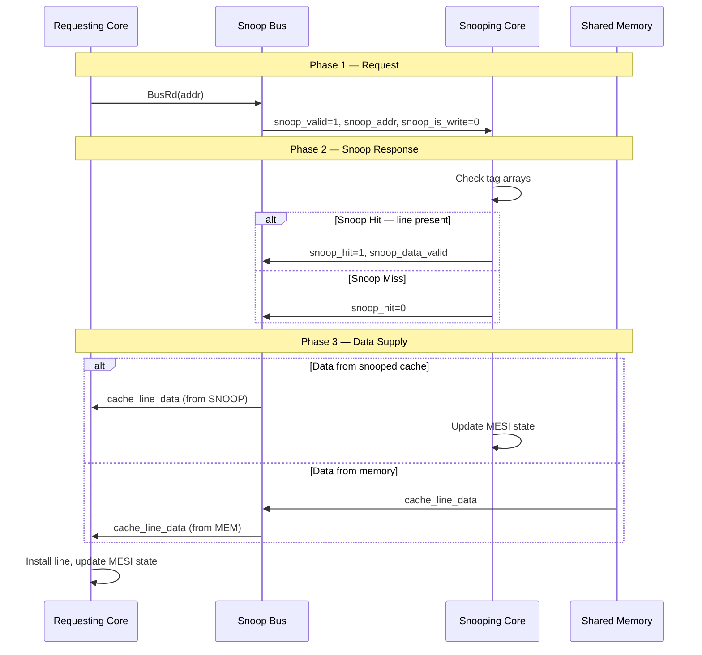
```mermaid
sequenceDiagram
    participant REQ as Requesting Core
    participant BUS as Snoop Bus
    participant SNOOP as Snooping Core
    participant MEM as Shared Memory

    Note over REQ,MEM: Phase 1 — Request
    REQ->>BUS: BusRd(addr)
    BUS->>SNOOP: snoop_valid=1, snoop_addr, snoop_is_write=0

    Note over REQ,MEM: Phase 2 — Snoop Response
    SNOOP->>SNOOP: Check tag arrays
    alt Snoop Hit — line present
        SNOOP->>BUS: snoop_hit=1, snoop_data_valid
    else Snoop Miss
        SNOOP->>BUS: snoop_hit=0
    end

    Note over REQ,MEM: Phase 3 — Data Supply
    alt Data from snooped cache
        BUS->>REQ: cache_line_data (from SNOOP)
        SNOOP->>SNOOP: Update MESI state
    else Data from memory
        MEM->>BUS: cache_line_data
        BUS->>REQ: cache_line_data (from MEM)
    end

    REQ->>REQ: Install line, update MESI state
```

### Snoop Channel Signals

| Signal | Width | Direction | Description |
|---|---|---|---|
| `snoop_valid` | 1 | Bus → Caches | Snoop transaction active |
| `snoop_addr` | 32 | Bus → Caches | Address being snooped |
| `snoop_is_write` | 1 | Bus → Caches | 1 = BusRdX/BusUpgr, 0 = BusRd |
| `snoop_source` | 2 | Bus → Caches | Requesting master ID |
| `snoop_hit` | 1 | Cache → Bus | Snooped cache has the line |
| `snoop_dirty` | 1 | Cache → Bus | Snooped line is Modified |
| `snoop_data` | 128 | Cache → Bus | Dirty data for intervention |

---

## 8. Dirty Intervention Protocol

This is the most complex coherency scenario: **Core 1 reads an address that Core 0 holds in Modified state**. The dirty data must be supplied by Core 0's cache — not stale memory.

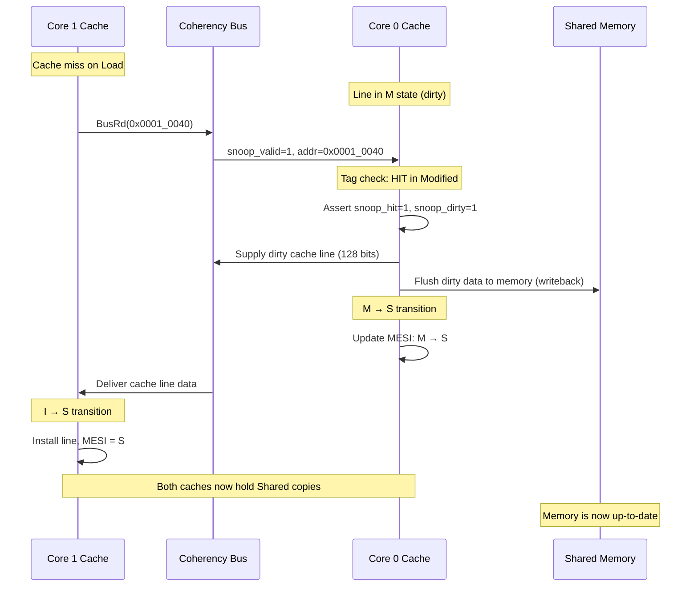
```mermaid
sequenceDiagram
    participant C1 as Core 1 Cache
    participant BUS as Coherency Bus
    participant C0 as Core 0 Cache
    participant MEM as Shared Memory

    Note over C1: Cache miss on Load
    Note over C0: Line in M state (dirty)

    C1->>BUS: BusRd(0x0001_0040)
    BUS->>C0: snoop_valid=1, addr=0x0001_0040

    Note over C0: Tag check: HIT in Modified
    C0->>C0: Assert snoop_hit=1, snoop_dirty=1

    C0->>BUS: Supply dirty cache line (128 bits)
    C0->>MEM: Flush dirty data to memory (writeback)

    Note over C0: M → S transition
    C0->>C0: Update MESI: M → S

    BUS->>C1: Deliver cache line data
    Note over C1: I → S transition
    C1->>C1: Install line, MESI = S

    Note over C1,C0: Both caches now hold Shared copies
    Note over MEM: Memory is now up-to-date
```

> [!NOTE]
> **Why this matters:** Without dirty intervention, Core 1 would read stale data from memory while Core 0 holds the only up-to-date copy. The snoop controller in Core 0 detects the BusRd, recognizes the Modified state, and supplies its dirty data directly — a defining feature of the MESI protocol.

---

## 9. AXI4-Lite Bus Fabric

The SoC employs a **4-master AXI4-Lite crossbar** with parameterized round-robin arbitration and optional priority override.

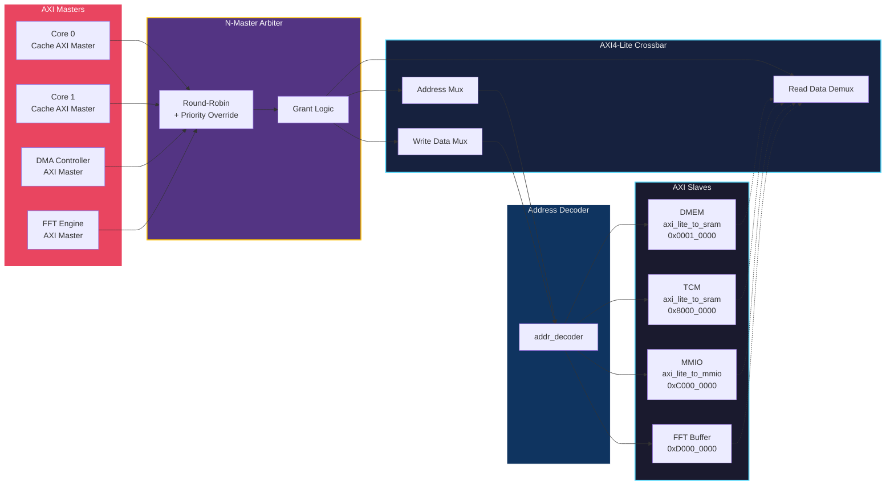
```mermaid
graph LR
    subgraph MASTERS["AXI Masters"]
        M0["Core 0<br/>Cache AXI Master"]
        M1["Core 1<br/>Cache AXI Master"]
        M2["DMA Controller<br/>AXI Master"]
        M3["FFT Engine<br/>AXI Master"]
    end

    subgraph ARBITER["N-Master Arbiter"]
        RR["Round-Robin<br/>+ Priority Override"]
        GRANT["Grant Logic"]
    end

    subgraph XBAR["AXI4-Lite Crossbar"]
        AMUX["Address Mux"]
        WMUX2["Write Data Mux"]
        RMUX["Read Data Demux"]
    end

    subgraph DECODER["Address Decoder"]
        DEC["addr_decoder"]
    end

    subgraph SLAVES["AXI Slaves"]
        S0["DMEM<br/>axi_lite_to_sram<br/>0x0001_0000"]
        S1["TCM<br/>axi_lite_to_sram<br/>0x8000_0000"]
        S2["MMIO<br/>axi_lite_to_mmio<br/>0xC000_0000"]
        S3["FFT Buffer<br/>0xD000_0000"]
    end

    M0 --> RR
    M1 --> RR
    M2 --> RR
    M3 --> RR

    RR --> GRANT
    GRANT --> AMUX
    GRANT --> WMUX2
    GRANT --> RMUX

    AMUX --> DEC
    WMUX2 --> DEC

    DEC --> S0
    DEC --> S1
    DEC --> S2
    DEC --> S3

    S0 -.-> RMUX
    S1 -.-> RMUX
    S2 -.-> RMUX
    S3 -.-> RMUX

    style MASTERS fill:#e94560,stroke:#fff,stroke-width:2px,color:#fff
    style ARBITER fill:#533483,stroke:#ffc300,stroke-width:2px,color:#fff
    style XBAR fill:#16213e,stroke:#53d8fb,stroke-width:2px,color:#eee
    style DECODER fill:#0f3460,stroke:#fff,stroke-width:1px,color:#eee
    style SLAVES fill:#1a1a2e,stroke:#53d8fb,stroke-width:2px,color:#eee
```

### AXI4-Lite Signal Summary

| Channel | Key Signals | Direction |
|---|---|---|
| **Write Address (AW)** | `awaddr[31:0]`, `awvalid`, `awready` | Master → Slave |
| **Write Data (W)** | `wdata[31:0]`, `wstrb[3:0]`, `wvalid`, `wready` | Master → Slave |
| **Write Response (B)** | `bresp[1:0]`, `bvalid`, `bready` | Slave → Master |
| **Read Address (AR)** | `araddr[31:0]`, `arvalid`, `arready` | Master → Slave |
| **Read Data (R)** | `rdata[31:0]`, `rresp[1:0]`, `rvalid`, `rready` | Slave → Master |

---

## 10. Memory Hierarchy

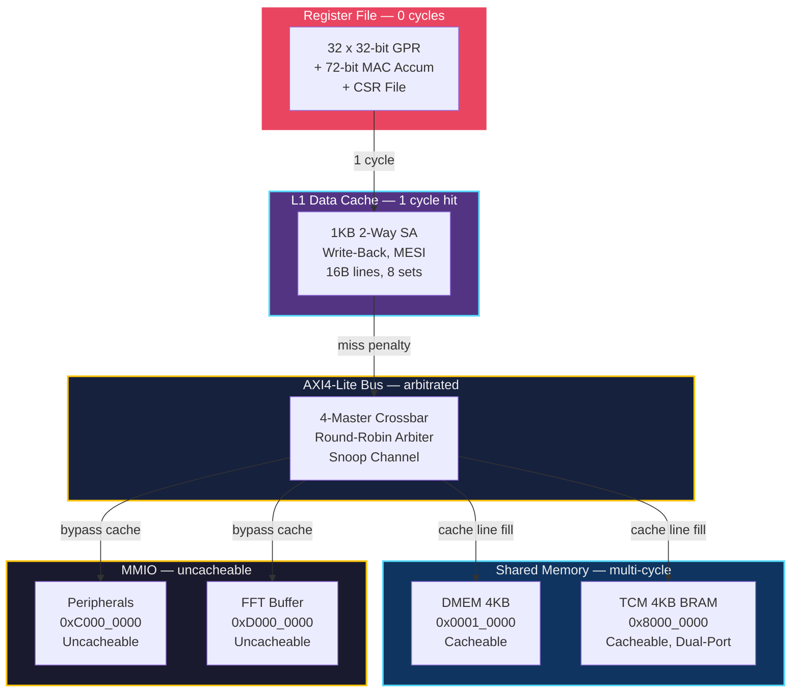
```mermaid
graph TB
    subgraph L0["Register File — 0 cycles"]
        RF["32 x 32-bit GPR<br/>+ 72-bit MAC Accum<br/>+ CSR File"]
    end

    subgraph L1["L1 Data Cache — 1 cycle hit"]
        DC["1KB 2-Way SA<br/>Write-Back, MESI<br/>16B lines, 8 sets"]
    end

    subgraph BUS["AXI4-Lite Bus — arbitrated"]
        ABUS["4-Master Crossbar<br/>Round-Robin Arbiter<br/>Snoop Channel"]
    end

    subgraph L2["Shared Memory — multi-cycle"]
        DMEM2["DMEM 4KB<br/>0x0001_0000<br/>Cacheable"]
        TCM2["TCM 4KB BRAM<br/>0x8000_0000<br/>Cacheable, Dual-Port"]
    end

    subgraph MMIO["MMIO — uncacheable"]
        PERIPH2["Peripherals<br/>0xC000_0000<br/>Uncacheable"]
        FFTBUF2["FFT Buffer<br/>0xD000_0000<br/>Uncacheable"]
    end

    RF -->|"1 cycle"| DC
    DC -->|"miss penalty"| ABUS
    ABUS -->|"cache line fill"| DMEM2
    ABUS -->|"cache line fill"| TCM2
    ABUS -->|"bypass cache"| PERIPH2
    ABUS -->|"bypass cache"| FFTBUF2

    style L0 fill:#e94560,stroke:#fff,stroke-width:2px,color:#fff
    style L1 fill:#533483,stroke:#53d8fb,stroke-width:2px,color:#fff
    style BUS fill:#16213e,stroke:#ffc300,stroke-width:2px,color:#eee
    style L2 fill:#0f3460,stroke:#53d8fb,stroke-width:2px,color:#eee
    style MMIO fill:#1a1a2e,stroke:#ffc300,stroke-width:2px,color:#eee
```

### Access Latency Budget

| Level | Latency (cycles) | Capacity | Notes |
|---|---|---|---|
| Register File | 0 (combinational read) | 32 × 32-bit | Dual read ports, single write port |
| L1 D-Cache (hit) | 1 | 1 KB | Tag check + data read in parallel |
| L1 D-Cache (miss, clean) | ~8–12 | — | Allocate + fill from bus |
| L1 D-Cache (miss, dirty) | ~12–18 | — | Writeback + allocate + fill |
| Shared DMEM | ~4–6 via bus | 4 KB | After arbitration |
| TCM (Port A) | ~4–6 via bus | 4 KB | After arbitration |
| TCM (Port B) | 1 (direct) | 4 KB | MAC/FFT direct path |

---

## 11. Address Map

| Region | Base Address | End Address | Size | Masters | Cacheable | Description |
|---|---|---|---|---|---|---|
| **Core 0 IMEM** | `0x0000_0000` | `0x0000_1FFF` | 8 KB | Core 0 only | N/A (instr) | Private instruction memory |
| **Core 1 IMEM** | `0x0000_2000` | `0x0000_3FFF` | 8 KB | Core 1 only | N/A (instr) | Private instruction memory |
| **Shared DMEM** | `0x0001_0000` | `0x0001_0FFF` | 4 KB | All masters | **Yes** | Shared data memory, coherent |
| **Shared TCM** | `0x8000_0000` | `0x8000_0FFF` | 4 KB | All masters | **Yes** | Tightly-coupled BRAM, dual-port |
| **Periph Base** | `0xC000_0000` | `0xC000_00FF` | 256 B | CPU only | **No** | Memory-mapped I/O |
| **FFT Buffer** | `0xD000_0000` | `0xD000_0FFF` | 4 KB | FFT + DMA | **No** | FFT ping-pong buffer |

### Peripheral Register Map

| Peripheral | Offset from `0xC000_0000` | Size | Registers |
|---|---|---|---|
| **I2C GPIO** | `0x0000` | 4 B | `GPIO_DATA` |
| **UART TX** | `0x0004` | 4 B | `UART_TX_DATA` |
| **7-Segment** | `0x0008` | 4 B | `SEG_DATA` |
| **Debug** | `0x000C` | 4 B | `DBG_DATA` |
| **FFT Control** | `0x0010` | 16 B | `FFT_CTRL`, `FFT_SIZE`, `FFT_SRC`, `FFT_DST` |
| **DMA Control** | `0x0020` | 16 B | `DMA_SRC`, `DMA_DST`, `DMA_LEN`, `DMA_CTRL` |
| **IRQ Controller** | `0x0030` | 16 B | `IRQ_PEND`, `IRQ_MASK`, `IRQ_ACK`, `IRQ_STATUS` |
| **IPI Mailbox** | `0x0040` | 16 B | `IPI_SEND`, `IPI_RECV`, `IPI_STATUS`, `IPI_ACK` |
| **CLINT Timer** | `0x0050` | 16 B | `MTIME_LO`, `MTIME_HI`, `MTIMECMP_LO`, `MTIMECMP_HI` |

---

## 12. DMA Controller

The DMA controller provides **autonomous memory-to-memory transfers** without CPU intervention, freeing the cores for computation.

### DMA FSM

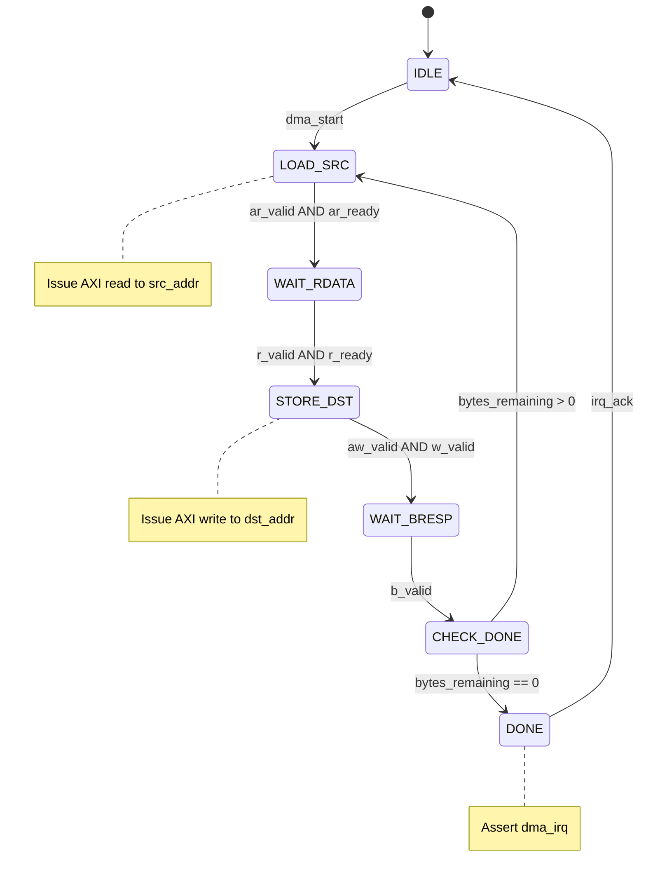
```mermaid
stateDiagram-v2
    [*] --> IDLE

    IDLE --> LOAD_SRC : dma_start
    LOAD_SRC --> WAIT_RDATA : ar_valid AND ar_ready
    WAIT_RDATA --> STORE_DST : r_valid AND r_ready
    STORE_DST --> WAIT_BRESP : aw_valid AND w_valid
    WAIT_BRESP --> CHECK_DONE : b_valid
    CHECK_DONE --> LOAD_SRC : bytes_remaining > 0
    CHECK_DONE --> DONE : bytes_remaining == 0
    DONE --> IDLE : irq_ack

    note right of LOAD_SRC : Issue AXI read to src_addr
    note right of STORE_DST : Issue AXI write to dst_addr
    note right of DONE : Assert dma_irq
```

### DMA Register Interface

| Register | Offset | R/W | Description |
|---|---|---|---|
| `DMA_SRC` | `0x0020` | R/W | Source address (word-aligned) |
| `DMA_DST` | `0x0024` | R/W | Destination address (word-aligned) |
| `DMA_LEN` | `0x0028` | R/W | Transfer length (bytes) |
| `DMA_CTRL` | `0x002C` | R/W | `[0]` start, `[1]` busy, `[2]` done, `[3]` irq_en |

---

## 13. FFT Accelerator

The hardware FFT engine performs **Radix-2 Decimation-in-Time** transforms using Q15 fixed-point arithmetic, offloading intensive DSP computation from the cores.

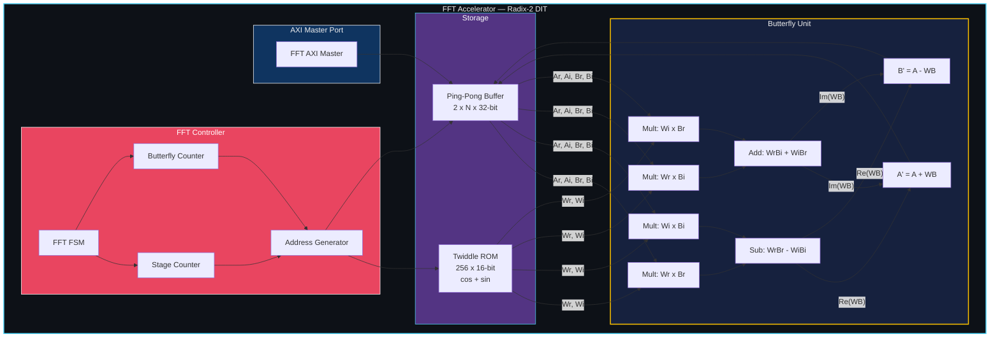
```mermaid
graph TB
    subgraph FFTOP["FFT Accelerator — Radix-2 DIT"]
        subgraph CONTROL2["FFT Controller"]
            FFSM["FFT FSM"]
            STGCNT["Stage Counter"]
            BFCNT["Butterfly Counter"]
            ADDRGEN["Address Generator"]
        end

        subgraph BUTTERFLY["Butterfly Unit"]
            MULA["Mult: Wr x Br"]
            MULB["Mult: Wi x Bi"]
            MULC["Mult: Wr x Bi"]
            MULD["Mult: Wi x Br"]
            SUBA["Sub: WrBr - WiBi"]
            ADDA["Add: WrBi + WiBr"]
            ADDOUT["A' = A + WB"]
            SUBOUT["B' = A - WB"]
        end

        subgraph STORAGE["Storage"]
            TROM["Twiddle ROM<br/>256 x 16-bit<br/>cos + sin"]
            PPBUF["Ping-Pong Buffer<br/>2 x N x 32-bit"]
        end

        subgraph AXIPORT2["AXI Master Port"]
            FFTAXI["FFT AXI Master"]
        end
    end

    FFSM --> STGCNT
    FFSM --> BFCNT
    STGCNT --> ADDRGEN
    BFCNT --> ADDRGEN

    ADDRGEN --> TROM
    ADDRGEN --> PPBUF

    TROM -->|"Wr, Wi"| MULA
    TROM -->|"Wr, Wi"| MULB
    TROM -->|"Wr, Wi"| MULC
    TROM -->|"Wr, Wi"| MULD

    PPBUF -->|"Ar, Ai, Br, Bi"| MULA
    PPBUF -->|"Ar, Ai, Br, Bi"| MULB
    PPBUF -->|"Ar, Ai, Br, Bi"| MULC
    PPBUF -->|"Ar, Ai, Br, Bi"| MULD

    MULA --> SUBA
    MULB --> SUBA
    MULC --> ADDA
    MULD --> ADDA

    SUBA -->|"Re(WB)"| ADDOUT
    ADDA -->|"Im(WB)"| ADDOUT
    SUBA -->|"Re(WB)"| SUBOUT
    ADDA -->|"Im(WB)"| SUBOUT

    ADDOUT --> PPBUF
    SUBOUT --> PPBUF

    FFTAXI --> PPBUF

    style FFTOP fill:#0d1117,stroke:#53d8fb,stroke-width:2px,color:#eee
    style CONTROL2 fill:#e94560,stroke:#fff,stroke-width:1px,color:#fff
    style BUTTERFLY fill:#16213e,stroke:#ffc300,stroke-width:2px,color:#eee
    style STORAGE fill:#533483,stroke:#53d8fb,stroke-width:1px,color:#fff
    style AXIPORT2 fill:#0f3460,stroke:#fff,stroke-width:1px,color:#eee
```

### Butterfly Computation

The Radix-2 DIT butterfly computes (using Q15 fixed-point):

```
WB = W × B = (Wr + jWi)(Br + jBi)
   Re(WB) = Wr·Br - Wi·Bi    (2 multiplies, 1 subtract)
   Im(WB) = Wr·Bi + Wi·Br    (2 multiplies, 1 add)

A' = A + WB
B' = A - WB
```

**Total per butterfly:** 4 multiplies, 6 add/subtract

### FFT Register Interface

| Register | Offset | R/W | Description |
|---|---|---|---|
| `FFT_CTRL` | `0x0010` | R/W | `[0]` start, `[1]` busy, `[2]` done, `[3]` irq_en |
| `FFT_SIZE` | `0x0014` | R/W | Transform size N (64, 128, 256, 512, 1024) |
| `FFT_SRC` | `0x0018` | R/W | Source address for input data |
| `FFT_DST` | `0x001C` | R/W | Destination address for output data |

---

## 14. Interrupt System

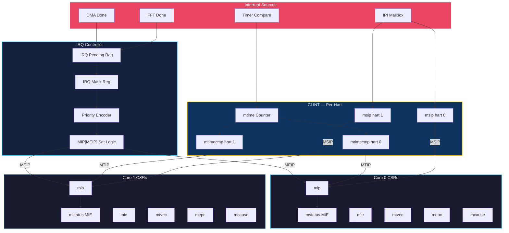
```mermaid
graph TB
    subgraph SOURCES["Interrupt Sources"]
        DMAIRQ["DMA Done"]
        FFTIRQ["FFT Done"]
        TIMIRQ["Timer Compare"]
        IPIIRQ["IPI Mailbox"]
    end

    subgraph IRQCTRL["IRQ Controller"]
        PEND["IRQ Pending Reg"]
        MASK["IRQ Mask Reg"]
        PRIOR["Priority Encoder"]
        MIPSET["MIP[MEIP] Set Logic"]
    end

    subgraph CLINTBLK["CLINT — Per-Hart"]
        MTIME2["mtime Counter"]
        MTCMP0["mtimecmp hart 0"]
        MTCMP1["mtimecmp hart 1"]
        MSIP0["msip hart 0"]
        MSIP1["msip hart 1"]
    end

    subgraph CORE0CSR["Core 0 CSRs"]
        MSTAT0["mstatus.MIE"]
        MIE0["mie"]
        MIP0["mip"]
        MTVEC0["mtvec"]
        MEPC0["mepc"]
        MCAUSE0["mcause"]
    end

    subgraph CORE1CSR["Core 1 CSRs"]
        MSTAT1["mstatus.MIE"]
        MIE1["mie"]
        MIP1["mip"]
        MTVEC1["mtvec"]
        MEPC1["mepc"]
        MCAUSE1["mcause"]
    end

    DMAIRQ --> PEND
    FFTIRQ --> PEND
    PEND --> MASK
    MASK --> PRIOR
    PRIOR --> MIPSET
    MIPSET -->|"MEIP"| MIP0
    MIPSET -->|"MEIP"| MIP1

    TIMIRQ --> MTIME2
    MTIME2 --> MTCMP0
    MTIME2 --> MTCMP1
    MTCMP0 -->|"MTIP"| MIP0
    MTCMP1 -->|"MTIP"| MIP1

    IPIIRQ --> MSIP0
    IPIIRQ --> MSIP1
    MSIP0 -->|"MSIP"| MIP0
    MSIP1 -->|"MSIP"| MIP1

    MIP0 --> MSTAT0
    MIP1 --> MSTAT1

    style SOURCES fill:#e94560,stroke:#fff,stroke-width:2px,color:#fff
    style IRQCTRL fill:#16213e,stroke:#53d8fb,stroke-width:2px,color:#eee
    style CLINTBLK fill:#0f3460,stroke:#ffc300,stroke-width:2px,color:#eee
    style CORE0CSR fill:#1a1a2e,stroke:#53d8fb,stroke-width:2px,color:#eee
    style CORE1CSR fill:#1a1a2e,stroke:#0f3460,stroke-width:2px,color:#eee
```

### Trap Sequence

```
1. Global interrupt enable checked:   mstatus.MIE == 1?
2. Interrupt type enabled:            mie.MEIE/MTIE/MSIE == 1?
3. Interrupt pending:                 mip.MEIP/MTIP/MSIP == 1?
4. If all YES → Trap:
   a. mepc    ← current PC
   b. mcause  ← interrupt cause code
   c. mstatus.MPIE ← mstatus.MIE
   d. mstatus.MIE  ← 0  (disable further interrupts)
   e. PC      ← mtvec (handler entry)
5. MRET:
   a. PC      ← mepc
   b. mstatus.MIE ← mstatus.MPIE
```

### CSR Register Summary (per core)

| CSR | Address | Description |
|---|---|---|
| `mhartid` | `0xF14` | Hardware thread ID (read-only: 0 or 1) |
| `mstatus` | `0x300` | Machine status: MIE, MPIE, MPP |
| `mie` | `0x304` | Interrupt enable: MEIE, MTIE, MSIE |
| `mip` | `0x344` | Interrupt pending: MEIP, MTIP, MSIP |
| `mtvec` | `0x305` | Trap handler base address |
| `mepc` | `0x341` | Exception program counter |
| `mcause` | `0x342` | Trap cause code |

---

## 15. Atomic Operations & Multi-Hart Boot

### A-Extension: Load-Reserved / Store-Conditional

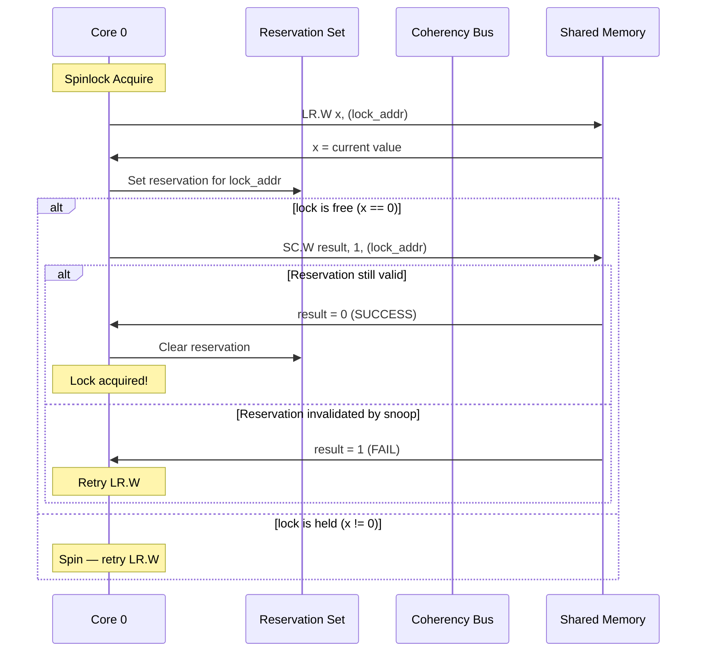
```mermaid
sequenceDiagram
    participant C0 as Core 0
    participant RES as Reservation Set
    participant BUS2 as Coherency Bus
    participant MEM2 as Shared Memory

    Note over C0: Spinlock Acquire
    C0->>MEM2: LR.W x, (lock_addr)
    MEM2->>C0: x = current value
    C0->>RES: Set reservation for lock_addr

    alt lock is free (x == 0)
        C0->>MEM2: SC.W result, 1, (lock_addr)
        alt Reservation still valid
            MEM2->>C0: result = 0 (SUCCESS)
            C0->>RES: Clear reservation
            Note over C0: Lock acquired!
        else Reservation invalidated by snoop
            MEM2->>C0: result = 1 (FAIL)
            Note over C0: Retry LR.W
        end
    else lock is held (x != 0)
        Note over C0: Spin — retry LR.W
    end
```

### Reservation Invalidation Sources

| Event | Description |
|---|---|
| Successful SC.W | Reservation consumed on successful store-conditional |
| Snoop write hit | Another core writes to the reserved address via BusRdX/BusUpgr |
| Context switch | Reservation cleared on trap entry/exit |
| Reset | All reservations cleared |

### AMO Operations

| Instruction | Operation | Atomicity Mechanism |
|---|---|---|
| `LR.W rd, (rs1)` | `rd ← M[rs1]; reserve(rs1)` | Set reservation |
| `SC.W rd, rs2, (rs1)` | `if reserved: M[rs1]←rs2, rd←0; else rd←1` | Check & clear reservation |
| `AMOSWAP.W rd, rs2, (rs1)` | `rd ← M[rs1]; M[rs1] ← rs2` | Bus lock (atomic read-modify-write) |
| `AMOADD.W rd, rs2, (rs1)` | `rd ← M[rs1]; M[rs1] ← M[rs1]+rs2` | Bus lock (atomic read-modify-write) |

### Multi-Hart Boot Sequence

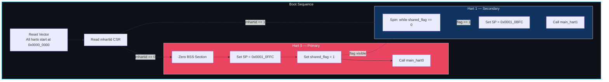
```mermaid
graph TD
    subgraph BOOT["Boot Sequence"]
        RST["Reset Vector<br/>All harts start at 0x0000_0000"]
        HARTCHK["Read mhartid CSR"]

        subgraph H0["Hart 0 — Primary"]
            BSS["Zero BSS Section"]
            STACK0["Set SP = 0x0001_0FFC"]
            FLAG["Set shared_flag = 1"]
            MAIN0["Call main_hart0"]
        end

        subgraph H1["Hart 1 — Secondary"]
            SPIN["Spin: while shared_flag == 0"]
            STACK1["Set SP = 0x0001_0BFC"]
            MAIN1["Call main_hart1"]
        end
    end

    RST --> HARTCHK
    HARTCHK -->|"mhartid == 0"| BSS
    HARTCHK -->|"mhartid == 1"| SPIN
    BSS --> STACK0
    STACK0 --> FLAG
    FLAG --> MAIN0
    FLAG -.->|"flag visible"| SPIN
    SPIN -->|"flag == 1"| STACK1
    STACK1 --> MAIN1

    style BOOT fill:#0d1117,stroke:#53d8fb,stroke-width:2px,color:#eee
    style H0 fill:#e94560,stroke:#fff,stroke-width:1px,color:#fff
    style H1 fill:#0f3460,stroke:#fff,stroke-width:1px,color:#eee
```

---

## 16. Physical Implementation

### ASIC Floorplan (Sky130 — 5mm × 5mm die)

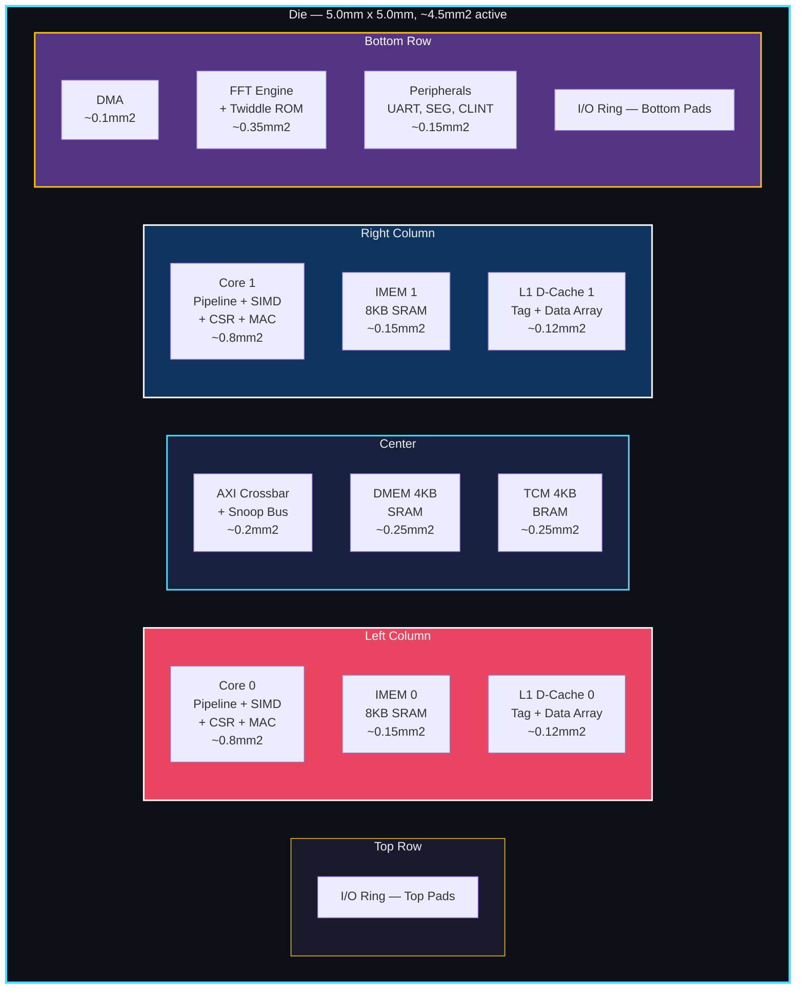
```mermaid
graph TB
    subgraph DIE["Die — 5.0mm x 5.0mm, ~4.5mm2 active"]
        subgraph TOPROW["Top Row"]
            IORING_T["I/O Ring — Top Pads"]
        end

        subgraph MIDLEFT["Left Column"]
            CORE0_FP["Core 0<br/>Pipeline + SIMD<br/>+ CSR + MAC<br/>~0.8mm2"]
            IMEM0_FP["IMEM 0<br/>8KB SRAM<br/>~0.15mm2"]
            L1D0_FP["L1 D-Cache 0<br/>Tag + Data Array<br/>~0.12mm2"]
        end

        subgraph CENTER["Center"]
            BUSXBAR["AXI Crossbar<br/>+ Snoop Bus<br/>~0.2mm2"]
            DMEM_FP["DMEM 4KB<br/>SRAM<br/>~0.25mm2"]
            TCM_FP["TCM 4KB<br/>BRAM<br/>~0.25mm2"]
        end

        subgraph MIDRIGHT["Right Column"]
            CORE1_FP["Core 1<br/>Pipeline + SIMD<br/>+ CSR + MAC<br/>~0.8mm2"]
            IMEM1_FP["IMEM 1<br/>8KB SRAM<br/>~0.15mm2"]
            L1D1_FP["L1 D-Cache 1<br/>Tag + Data Array<br/>~0.12mm2"]
        end

        subgraph BOTROW["Bottom Row"]
            DMA_FP["DMA<br/>~0.1mm2"]
            FFT_FP["FFT Engine<br/>+ Twiddle ROM<br/>~0.35mm2"]
            PERIPH_FP["Peripherals<br/>UART, SEG, CLINT<br/>~0.15mm2"]
            IORING_B["I/O Ring — Bottom Pads"]
        end
    end

    style DIE fill:#0d1117,stroke:#53d8fb,stroke-width:3px,color:#eee
    style TOPROW fill:#1a1a2e,stroke:#ffc300,stroke-width:1px,color:#eee
    style MIDLEFT fill:#e94560,stroke:#fff,stroke-width:2px,color:#fff
    style CENTER fill:#16213e,stroke:#53d8fb,stroke-width:2px,color:#eee
    style MIDRIGHT fill:#0f3460,stroke:#fff,stroke-width:2px,color:#eee
    style BOTROW fill:#533483,stroke:#ffc300,stroke-width:2px,color:#fff
```

### FPGA Resource Budget — Xilinx Artix-7 xc7a35t

| Module | LUTs | FFs | BRAM (36Kb) | DSP48 | Notes |
|---|---|---|---|---|---|
| Core 0 Pipeline | ~3,200 | ~1,800 | — | — | 6-stage with forwarding |
| Core 1 Pipeline | ~3,200 | ~1,800 | — | — | Identical to Core 0 |
| SIMD ALU × 2 | ~1,200 | ~200 | — | — | Segmented carry-kill |
| MAC Unit × 2 | ~600 | ~300 | — | 4 | 72-bit accumulator |
| L1 D-Cache × 2 | ~2,400 | ~1,600 | 2 | — | Tag + Data + Controller |
| Snoop Controllers × 2 | ~400 | ~200 | — | — | MESI tracking |
| AXI Crossbar | ~1,800 | ~800 | — | — | 4-master arbiter |
| DMA Controller | ~600 | ~400 | — | — | AXI master FSM |
| FFT Engine | ~2,800 | ~1,200 | 2 | 8 | Butterfly + twiddle ROM |
| IMEM × 2 | — | — | 4 | — | 2 × 8KB |
| DMEM | — | — | 2 | — | 4KB |
| TCM | — | — | 2 | — | 4KB TDP |
| FFT Buffer | — | — | 2 | — | Ping-pong |
| Peripherals | ~1,200 | ~800 | — | — | UART, SEG, IRQ, CLINT |
| **Total** | **~17,600** | **~9,100** | **14** | **12** | **~86% LUT utilization** |
| **Available (xc7a35t)** | 20,800 | 41,600 | 50 | 90 | |
| **Utilization** | **~85%** | **~22%** | **~28%** | **~13%** | |

### ASIC Area Budget — Sky130 PDK

| Module | Est. Area (mm²) | % of Die |
|---|---|---|
| Core 0 (pipeline + SIMD + MAC + CSR) | 0.80 | 17.8% |
| Core 1 (pipeline + SIMD + MAC + CSR) | 0.80 | 17.8% |
| L1 D-Cache × 2 (tag + data + ctrl) | 0.24 | 5.3% |
| IMEM × 2 (8KB SRAM each) | 0.30 | 6.7% |
| DMEM (4KB SRAM) | 0.25 | 5.6% |
| TCM (4KB BRAM) | 0.25 | 5.6% |
| AXI Crossbar + Snoop Bus | 0.20 | 4.4% |
| DMA Controller | 0.10 | 2.2% |
| FFT Engine + Twiddle ROM + Buffer | 0.35 | 7.8% |
| Peripherals (UART, SEG, CLINT, IRQ) | 0.15 | 3.3% |
| I/O Ring + Pad Frame | 0.60 | 13.3% |
| Routing + Fill | 0.46 | 10.2% |
| **Total Active Die** | **~4.50** | **100%** |

---

## 17. Technology Specifications

| Parameter | FPGA Target | ASIC Target |
|---|---|---|
| **Technology** | Xilinx Artix-7 (28nm) | SkyWater Sky130 (130nm) |
| **Part** | xc7a35t-cpg236 | sky130_fd_sc_hd |
| **Target Frequency** | 50 MHz | 40–50 MHz |
| **Supply Voltage** | 1.0V (core) | 1.8V |
| **Die Size** | N/A (FPGA fabric) | ~5.0mm × 5.0mm |
| **Active Area** | 86% LUT utilization | ~4.5 mm² |
| **Power (est.)** | ~250 mW | ~150 mW |
| **Tool Flow** | Vivado 2023.x | OpenLane 2 / OpenROAD |
| **Verification** | Verilator + cocotb | DRC + LVS + STA |
| **ISA** | RV32IM + A + P (subset) | RV32IM + A + P (subset) |
| **Cores** | 2 | 2 |
| **Coherency** | MESI Snoopy | MESI Snoopy |
| **On-chip SRAM** | 28 KB total | 28 KB total |

---

## 18. Module Inventory

### RTL Source Tree (Target State)

```
CoreAccel_V/
├── soc_top.sv                          # Top-level SoC integration
│
├── rtl/core/                           # Per-hart processor core
│   ├── core_top.sv                     # Single-hart top wrapper
│   ├── alu.sv                          # SIMD-capable segmented ALU
│   ├── mac_unit.sv                     # 72-bit MAC with abort
│   ├── control_unit_pipe.sv            # Pipeline control decoder
│   ├── csr_file.sv                     # Machine-mode CSR file
│   ├── hazard_detection_unit.sv        # Load-use + control hazards
│   ├── forwarding_unit.sv              # 3-stage data forwarding
│   ├── register_file.sv               # 32x32 dual-read GPR file
│   ├── imm_gen_pipe.sv                 # Immediate generator
│   ├── pc_pipe.sv                      # Program counter logic
│   ├── if1_if2_reg.sv                  # IF1→IF2 pipeline register
│   ├── if_id_reg.sv                    # IF2→ID pipeline register
│   ├── id_ex_reg.sv                    # ID→EX pipeline register
│   ├── ex_mem_reg.sv                   # EX→MEM pipeline register
│   └── mem_wb_reg.sv                   # MEM→WB pipeline register
│
├── rtl/cache/                          # L1 data cache + coherency
│   ├── mesi_pkg.sv                     # MESI type definitions
│   ├── l1_dcache.sv                    # L1 cache top-level
│   ├── cache_controller.sv             # Cache FSM controller
│   ├── tag_array.sv                    # Tag storage array
│   ├── data_array.sv                   # Data storage array
│   ├── snoop_controller.sv             # Per-core snoop handler
│   ├── coherency_bus.sv                # Shared snoop bus logic
│   └── cache_axi_master.sv             # Cache↔bus AXI master
│
├── rtl/mem/                            # Memory subsystem
│   ├── mem_wrapper.sv                  # Unified memory interface
│   ├── instruction_memory.sv           # IMEM (per-core, 8KB)
│   ├── data_memory.sv                  # DMEM (shared, 4KB)
│   ├── tcm_ram.sv                      # TCM BRAM (TDP, 4KB)
│   ├── tcm_port_b_arbiter.sv          # Port-B arb: MAC vs FFT
│   └── tcm_arbiter.sv                  # Port-A arb: cores vs DMA
│
├── rtl/bus/                            # AXI4-Lite bus fabric
│   ├── axi_lite_if.sv                  # AXI4-Lite interface def
│   ├── axi_lite_xbar.sv               # Crossbar switch
│   ├── axi_lite_arbiter.sv             # N-master round-robin
│   ├── addr_decoder.sv                 # Address region decoder
│   ├── axi_lite_to_sram.sv             # AXI→SRAM bridge
│   ├── axi_lite_to_mmio.sv             # AXI→MMIO bridge
│   └── cpu_bus_master.sv               # CPU→AXI master adapter
│
├── rtl/dma/                            # DMA subsystem
│   ├── dma_controller.sv               # DMA top-level
│   ├── dma_fsm.sv                      # DMA state machine
│   └── dma_axi_master.sv               # DMA AXI master port
│
├── rtl/fft/                            # FFT accelerator
│   ├── fft_top.sv                      # FFT top-level
│   ├── fft_controller.sv               # FFT sequencing FSM
│   ├── fft_butterfly.sv                # Radix-2 butterfly
│   ├── twiddle_rom.sv                  # Twiddle factor ROM
│   └── fft_buffer.sv                   # Ping-pong buffer
│
├── rtl/periph/                         # Peripheral controllers
│   ├── uart_tx.sv                      # UART transmitter
│   ├── seg_display.sv                  # 7-segment display driver
│   ├── irq_controller.sv              # Interrupt controller
│   └── clint.sv                        # CLINT timer + IPI
│
├── sim/                                # Testbenches
├── firmware_v2/                        # Software / firmware
├── constraints/                        # FPGA constraints (XDC)
└── docs/                               # Documentation
```

### Module Dependency Graph

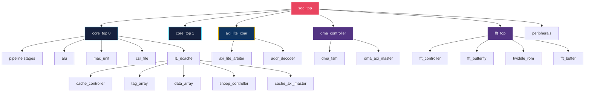
```mermaid
graph TB
    SOC["soc_top"] --> CT0["core_top 0"]
    SOC --> CT1["core_top 1"]
    SOC --> XBAR2["axi_lite_xbar"]
    SOC --> DMAC["dma_controller"]
    SOC --> FFTT["fft_top"]
    SOC --> PERIPHS["peripherals"]

    CT0 --> PIPE["pipeline stages"]
    CT0 --> ALU2["alu"]
    CT0 --> MACU["mac_unit"]
    CT0 --> CSRF["csr_file"]
    CT0 --> L1DC["l1_dcache"]

    L1DC --> CCTRL["cache_controller"]
    L1DC --> TARR["tag_array"]
    L1DC --> DARR["data_array"]
    L1DC --> SCTRL["snoop_controller"]
    L1DC --> CAXIM["cache_axi_master"]

    XBAR2 --> ARBI["axi_lite_arbiter"]
    XBAR2 --> ADDEC["addr_decoder"]

    DMAC --> DFSM["dma_fsm"]
    DMAC --> DAXIM["dma_axi_master"]

    FFTT --> FCTRL["fft_controller"]
    FFTT --> FBFLY["fft_butterfly"]
    FFTT --> TWROM["twiddle_rom"]
    FFTT --> FBUF["fft_buffer"]

    style SOC fill:#e94560,stroke:#fff,stroke-width:3px,color:#fff
    style CT0 fill:#16213e,stroke:#53d8fb,stroke-width:2px,color:#eee
    style CT1 fill:#16213e,stroke:#53d8fb,stroke-width:2px,color:#eee
    style XBAR2 fill:#0f3460,stroke:#ffc300,stroke-width:2px,color:#eee
    style DMAC fill:#533483,stroke:#fff,stroke-width:1px,color:#fff
    style FFTT fill:#533483,stroke:#fff,stroke-width:1px,color:#fff
```

---

## TCM Dual-Port Architecture

The Tightly-Coupled Memory provides **simultaneous access** from two independent sources via a true dual-port BRAM:

| Port | Connected To | Arbitration | Priority |
|---|---|---|---|
| **Port A** | CPU cores + DMA (via AXI bus fabric) | Bus arbiter (round-robin) | Equal |
| **Port B** | Active core MAC + FFT engine | `tcm_port_b_arbiter` | MAC > FFT |

> [!Important]
> The dual-port architecture allows the MAC unit to stream TCM data for multiply-accumulate operations **simultaneously** with CPU or DMA access on Port A — zero contention for the most common DSP pattern.


---

<div align="center">

**CoreAccel-V** · Cache-Coherent Dual-Core SIMD DSP SoC  
*Architecture Specification v1.0*

</div>

